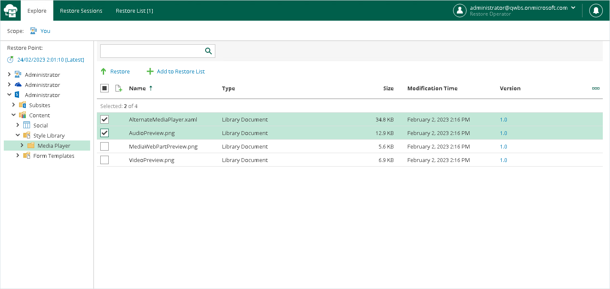
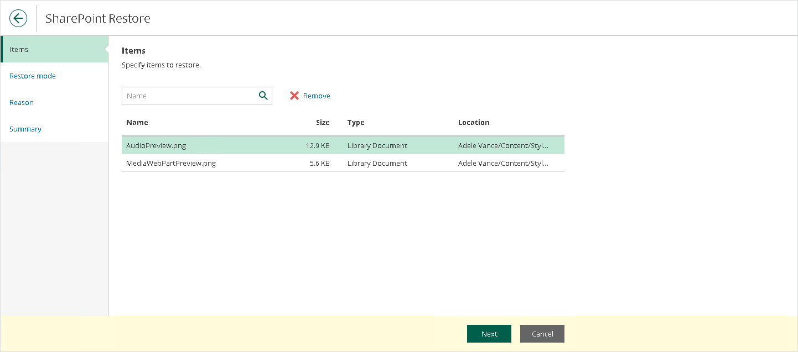
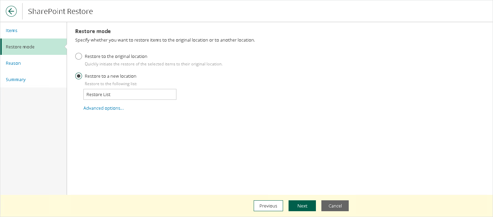
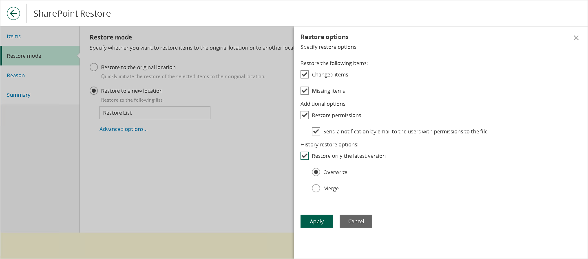
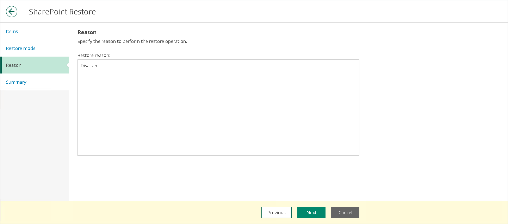

# SharePoint Restore

To restore SharePoint items, do the following:

1. Open the Explore tab.
2. Select a restore point from which you want to explore and restore data. For more information, see [Selecting Restore Point](ssp_selecting_restore_point.md).
3. In the navigation pane, browse through the hierarchy of folders with backed-up data.
4. Select a folder that contains data you want to restore.
5. In the preview pane, select check boxes next to the necessary SharePoint items.

For SharePoint folders, documents and list items, you can select which version of an item you want to restore. To do this, in the Version column, click the most recent version number, and in the displayed window, select the earlier version to restore.

|  |
| --- |
| Note |
| Consider the following:   * Restore Portal displays up to 2000 items, so search for specific items. * You can narrow your search results by specifying various search criteria using the criteria:value format. For more information about search parameters, see [Appendix A. Item Search Parameters](appendix_search.md). * You can also use logical upper-cased operators such as AND, OR and NOT along with wildcard characters such as \* and ?. * To search items by a specific date/time, specify the time in the UTC format. You can hover over the date in the Received column to view the UTC value. |

1. Click Restore.

The SharePoint Restore wizard runs to configure the restore operation options.

1. At the Items step, specify items that you want to restore. If you no longer want to restore an item, select it and click Remove.

1. At the Restore mode step, select where you want to restore the selected items:

* Restore to the original location. Select this option if you want to restore the selected items to their original location.
* Restore to a new location. Select this option if you want to restore the selected items to another location and specify the list name in the Restore to the following list field.

Keep in mind that if you restore documents or list items, you must specify a document library or a list that exists in the original SharePoint site.

1. Click Advanced options to open the Restore options dialog.
2. In the Restore options dialog, select check boxes next to the additional options that you want to apply during the restore operation and then click Apply:

* Changed items. Select this check box if you want to restore data that has been modified in the production environment.

* Missing items. Select this check box if you want to restore missing items.

* Restore permissions. Select this check box if you want to restore permissions.

* Send a notification by email to the users with permissions to the file. Select this check box if you want to notify users about items restore. Veeam Backup for Microsoft 365 will notify users with whom items have been shared. You can select this check box only if the Restore permissions check box is selected.

* Restore only the latest version. Select this check box if you want to restore only the latest version of items. If this check box is selected, you can select one of the following options:

* Overwrite. Select this option to overwrite data in the production environment.

* Merge. Select this option to merge an existing and a backup version of items.

1. [Optional] At the Reason step, specify a restore reason. This information will be available in the Reason column on the Restore Sessions tab and you will be able to reference it later.

1. At the Summary step, review details of the restore operation and click Finish.

Restore Portal runs the restore operation immediately and opens the [Restore Sessions](ssp_ui.md#restore_sessions) tab, where you view details about restore session progress and results.

