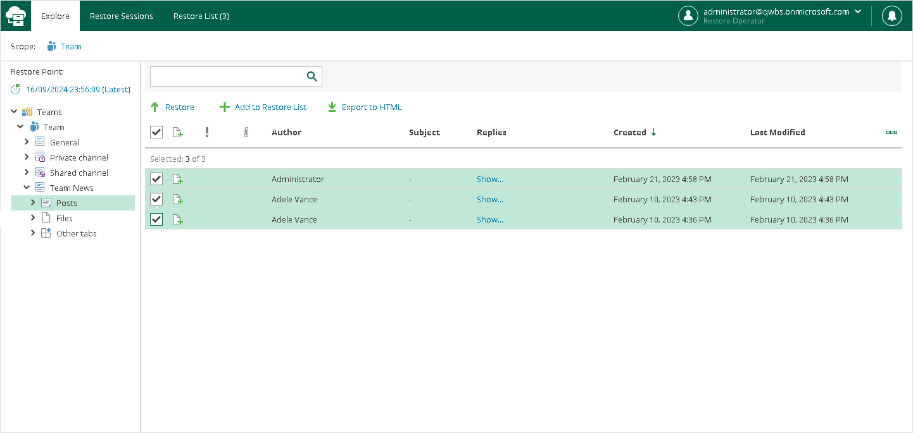
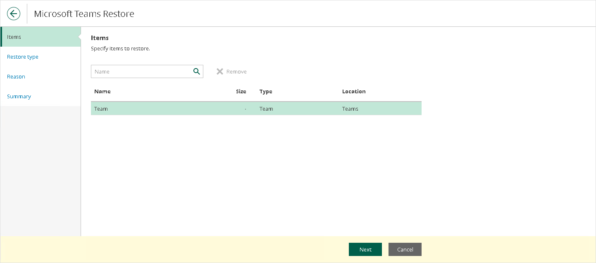
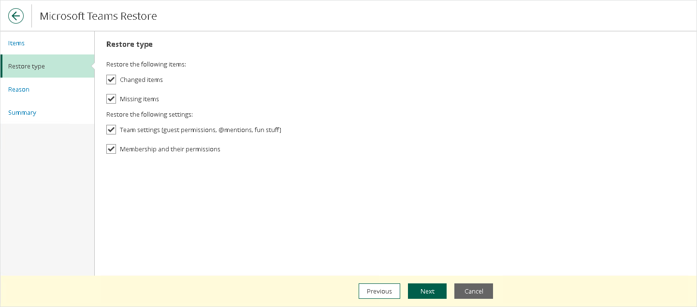
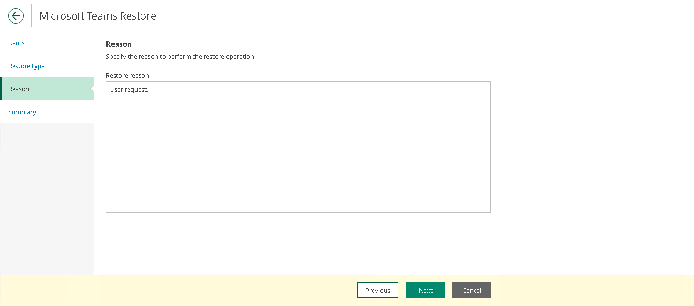

In this article

To restore Microsoft Teams items, do the following:

1. Open the Explore tab.
2. Select a restore point from which you want to explore and restore data. For more information, see [Selecting Restore Point](ssp_selecting_restore_point.md).
3. In the navigation pane, browse through the hierarchy of folders with backed-up data.
4. Select a folder that contains data you want to restore.
5. In the preview pane, select check boxes next to the necessary Microsoft Teams items.

For Microsoft Teams folders and files, you can select which version of an item you want to restore. To do this, in the Version column, click the most recent version number, and in the displayed window, select the earlier version to restore.

For Microsoft Teams posts, you can select which replies to the selected post you want to restore. To do this, in the Replies column, click Show, and in the displayed window, select check boxes next to replies that you want to restore.

|  |
| --- |
| Note |
| Consider the following:   * Restore Portal displays up to 2000 items, so search for specific items. * You can narrow your search results by specifying various search criteria using the criteria:value format. For more information about search parameters, see [Appendix A. Item Search Parameters](appendix_search.md). * You can also use logical upper-cased operators such as AND, OR and NOT along with wildcard characters such as \* and ?. * To search items by a specific date/time, specify the time in the UTC format. You can hover over the date in the Received column to view the UTC value. |

1. Click Restore.

The Microsoft Teams Restore wizard runs to configure the restore operation options.

1. At the Items step, specify items that you want to restore. If you no longer want to restore an item, select it and click Remove.

1. [Unavailable for the Posts tab and posts] At the Restore type step, select check boxes next to the restore options that you want to apply during the restore operation:

* For teams:

* Changed items. Select this check box if you want to restore data that has been modified in the production environment.

* Missing items. Select this check box if you want to restore missing items.

* Team settings (guest permissions, @mentions, fun stuff). Select this check box if you want to restore settings of the team.

* Membership and their permissions. Select this check box if you want to restore members of the team along with their roles.

* For team channels and the Other tabs tab:

* Changed items. Select this check box if you want to restore data that has been modified in the production environment.

* Missing items. Select this check box if you want to restore missing items.

* For private and shared team channels:

* Changed items. Select this check box if you want to restore data that has been modified in the production environment.

* Missing items. Select this check box if you want to restore missing items.
* Restore channel members and their permissions. Select this check box if you want to restore channel members and their permissions.

* For the Files tab and files:

* Changed items. Select this check box if you want to restore data that has been modified in the production environment.

* Missing items. Select this check box if you want to restore missing items.
* Restore only the latest version. Select this check box if you want to restore only the latest version of items.

1. [Optional] At the Reason step, specify a restore reason. This information will be available in the Reason column on the Restore Sessions tab and you will be able to reference it later.

1. At the Summary step, review details of the restore operation and click Finish.

Restore Portal runs the restore operation immediately and opens the [Restore Sessions](ssp_ui.md#restore_sessions) tab, where you view details about restore session progress and results.

Page updated 3/13/2025

Page content applies to build 8.3.0.2201
