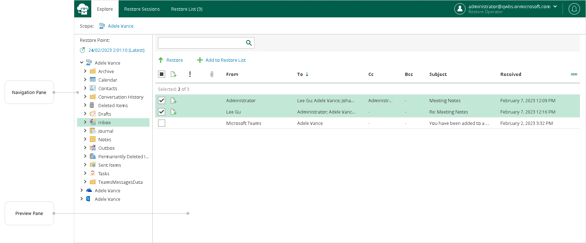
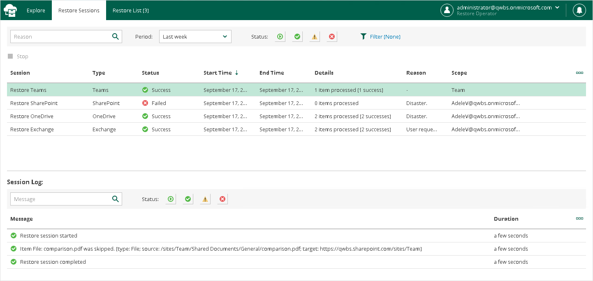
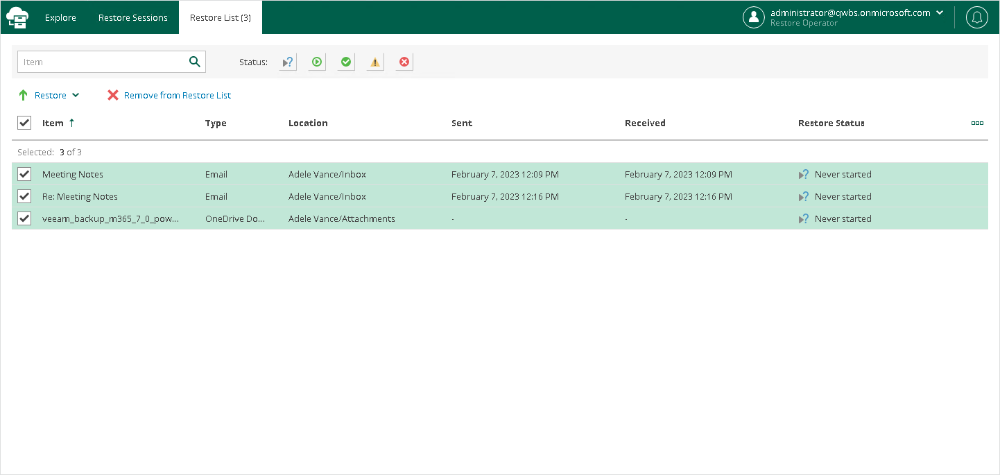

# User Interface

The web-based user interface of Restore Portal is designed to let you quickly explore backed-up Microsoft Exchange, Microsoft SharePoint, Microsoft OneDrive for Business and Microsoft Teams data in one window. Also, it allows you to perform restore operations without using Veeam Explorers and view details about restore sessions progress and results and the restore sessions history.

The main window consists of the Explore, Restore Sessions and Restore List tabs.

Explore Tab

This tab contains the navigation and preview panes.

Navigation Pane

The navigation pane allows you to do the following:

* If you are a restore operator, you can select an object that you want to manage. For more information, see [Changing Restore Operator Scope](ssp_changing_scope.md).
* Select a restore point from which you want to explore and restore data from backups created by Veeam Backup for Microsoft 365. For more information, see [Selecting Restore Point](ssp_selecting_restore_point.md).
* Browse through the hierarchy of folders with backed-up data. Nodes with Microsoft Exchange, Microsoft OneDrive for Business, Microsoft SharePoint and Microsoft Teams data are displayed in the navigation pane separately. Availability of nodes differs depending on backups created by Veeam Backup for Microsoft 365 for an object whose backed-up data is explored at the moment.

For example, for a user object the following data can be displayed:

* Exchange Online mailbox
* Archive mailbox
* OneDrive for Business
* Personal Site (available only for restore operators)

For restore operators, Restore Portal displays data for user objects, SharePoint sites and teams that restore operators are allowed to explore.

Preview Pane

The preview pane allows you to view details about items that are contained in a folder you have selected in the navigation pane. Items are displayed according to the selected restore point. You can search items and select items that you want to restore or add to the restore list.

|  |
| --- |
| Note |
| Consider the following:   * Restore Portal displays up to 2000 items, so search for specific items. * You can narrow your search results by specifying various search criteria using the criteria:value format. For more information about search parameters, see [Appendix A. Item Search Parameters](appendix_search.md). * You can also use logical upper-cased operators such as AND, OR and NOT along with wildcard characters such as \* and ?. * To search items by a specific date/time, specify the time in the UTC format. You can hover over the date in the Received column to view the UTC value. |

Restore Sessions Tab

On this tab, you view details about restore session progress and results.

You can do the following:

* Stop a restore session.
* Search and filter restore sessions by type, status and time period.
* View the list of events that occurred during a restore session, search and filter events by their status.

Restore List Tab

On this tab, you view and edit the content of the restore list. This tab appears only if a restore list is not empty.

You can do the following:

* Select items that you want to restore.
* Remove items from the restore list.
* Search and filter items by their restore status.

Notification Pane

Notification pane is hidden in the upper-right corner of the Restore Portal window under the notification icon shaped like a bell.

To expand the notification pane, click the notification icon.

For more information, see [Managing Notifications](ssp_notifications.md).

