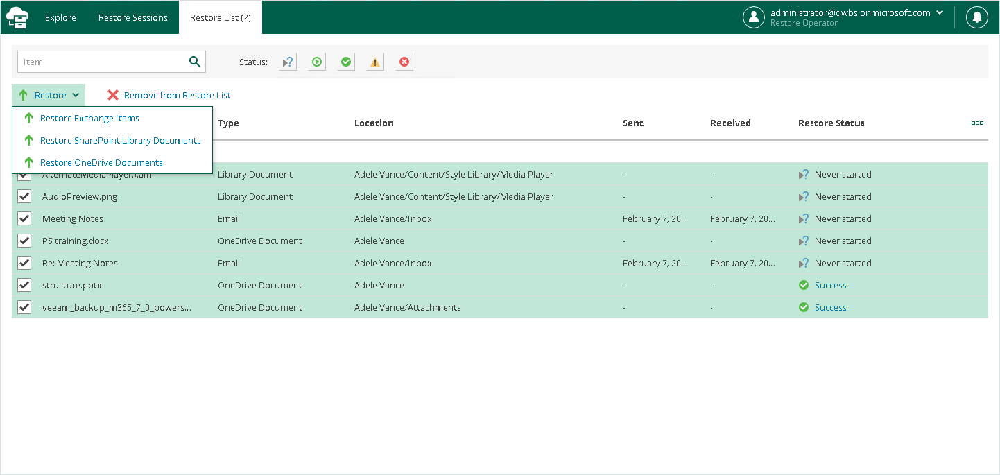

# Using Restore List

If you want to select items located in different folders in the hierarchy of folders with backed-up data displayed in the navigation pane, you can add them to the restore list. For example, you can add to the restore list one by one items of different types: for a user — mailbox items, OneDrive and SharePoint files, for a team — Microsoft Teams files, tabs and posts, and proceed to their restore.

|  |
| --- |
| Note |
| You cannot add the following objects to the restore list:   * OneDrive and SharePoint folders * Microsoft Teams teams, channels, tabs and folders |

To add items to the restore list, do the following:

1. Open the Explore tab.
2. In the navigation pane, browse through the hierarchy of folders with backed-up data.
3. Select a folder that contains data you want to restore.
4. In the preview pane, select check boxes next to the necessary items.

For mailbox folders, documents, list items and files, you can select which version of an item you want to restore. To do this, in the Version column, click the most recent version number, and in the displayed window, select the earlier version to restore.

For Microsoft Teams posts, you can select which replies to the selected post you want to restore. To do this, in the Replies column, click Show, and in the displayed window, select check boxes next to replies that you want to restore.

|  |
| --- |
| Note |
| Consider the following:   * Restore Portal displays up to 2000 items, so search for specific items. * You can narrow your search results by specifying various search criteria using the criteria:value format. For more information about search parameters, see [Appendix A. Item Search Parameters](appendix_search.md). * You can also use logical upper-cased operators such as AND, OR and NOT along with wildcard characters such as \* and ?. * To search items by a specific date/time, specify the time in the UTC format. You can hover over the date in the Received column to view the UTC value. |

1. Click Add to Restore List.
2. Repeat steps 2–5 to add more items to the restore list.
3. On the Restore List tab, review the list of items that you added to the restore list.
4. To restore items, select check boxes next to the necessary items and click Restore and then select one of the following options:

* Restore Exchange Items. This option runs the [Exchange Restore](ssp_exchange_restore.md#start_wizard) wizard.
* Restore OneDrive Documents. This option runs the [OneDrive Restore](ssp_onedrive_restore.md#start_wizard) wizard.
* Restore SharePoint List Items. This option runs the [SharePoint Restore](ssp_sharepoint_restore.md#start_wizard) wizard.
* Restore SharePoint Library Documents. This option runs the [SharePoint Restore](ssp_sharepoint_restore.md#start_wizard) wizard.
* Restore Teams Files. This option runs the [Microsoft Teams Restore](ssp_teams_restore.md#start_wizard) wizard.
* Restore Teams Tabs. This option runs the [Microsoft Teams Restore](ssp_teams_restore.md#start_wizard) wizard.
* Restore Teams Posts. This option runs the [Microsoft Teams Restore](ssp_teams_restore.md#start_wizard) wizard.

|  |
| --- |
| Tip |
| To remove items from the restore list, select check boxes next to the necessary items and click Remove from Restore List. |

1. Follow the steps of the wizard that you ran and configure restore operation options. Keep in mind that you must run wizards manually one after another.

