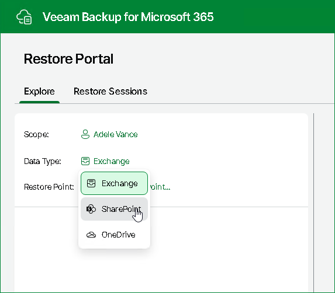

# Selecting Workload

After logging in to Restore Portal in the self-service restore scenario or after [selecting an object to manage](ssp_changing_scope.md) in the operator restore scenario, Restore Portal requires a workload that contains backed-up data you want to explore and restore to be selected.

You can select one of the following workloads:

* Exchange. This workload is available for objects of the User type.
* SharePoint. This workload is available for objects of the User and Site types.
* OneDrive. This workload is available for objects of the User type.
* Teams. This workload is available for objects of the Team type.

To select a workload that contains backed-up data you want to explore and restore, do the following:

1. Click the name of the workload that was last managed for the selected scope.
2. From the Data Type drop-down list, select a workload that you want to use.

