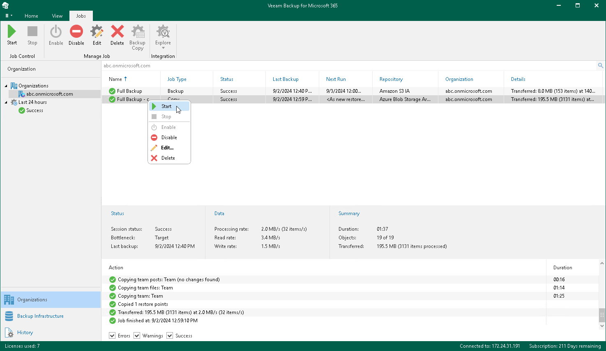

In this article

By default, a backup copy job starts automatically either right after appearing of the latest restore point in the source object storage repository or if you configure to run your backup copy job periodically – right after its creation and then in the specified time interval.

You can start your backup copy job manually. Manual start can be helpful if the backup copy job was disabled for some time or if a new restore point has already appeared in the source object storage repository but the backup copy job was configured to run daily or periodically.

|  |
| --- |
| Note |
| Consider the following:   * Veeam Backup for Microsoft 365 processes only the latest restore point that appeared in the source object storage repository since this backup copy job was created. * Restore points created by versions of Veeam Backup for Microsoft 365 earlier than 6.0 are not processed. |

To start a backup copy job manually, do the following:

1. Open the Organizations view.
2. In the inventory pane, select an organization.

|  |
| --- |
| Tip |
| You can also select the root Organizations node to see all backup and backup copy jobs that were created for all organizations added to the scope. |

1. In the preview pane, do one of the following:

* Select a backup copy job and click Start on the ribbon.
* Right-click a backup copy job and select Start.

A backup copy job name consists of a backup job name for which a backup copy job is created and the copy job postfix.

Page updated 5/20/2025

Page content applies to build 8.3.0.2201
