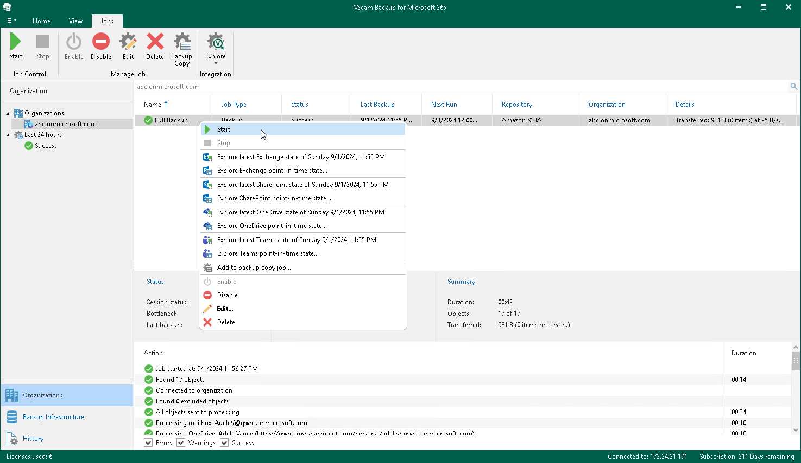

# Starting Backup Job

You can start and restart your backup job manually. Manual restart can be helpful if you are beyond the allowed backup window.

Keep in mind that when you restart the backup job, Veeam Backup for Microsoft 365 starts data processing from the beginning and may need additional time to re-identify the state of the backed-up data. After that Veeam Backup for Microsoft 365 continues with the remaining data to back up.

To start a backup job, do the following:

1. Open the Organizations view.
2. In the inventory pane, select an organization.

|  |
| --- |
| Tip |
| You can also select the root Organizations node to see all backup and backup copy jobs that were created for all organizations added to the scope. |

1. In the preview pane, do one of the following:

* Select a backup job and click Start on the ribbon.

* Right-click a backup job and select Start.

