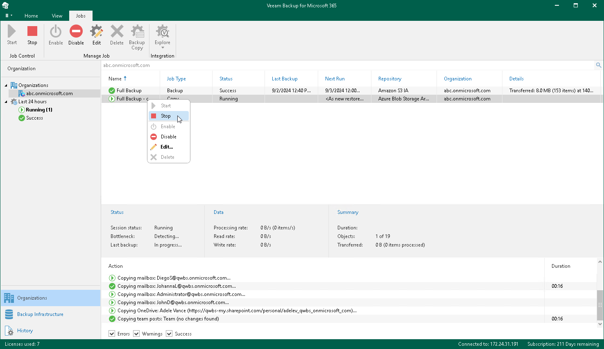

# Stopping Backup Copy Job

To stop a backup copy job, do the following:

1. Open the Organizations view.
2. In the inventory pane, select an organization.

|  |
| --- |
| Tip |
| You can also select the root Organizations node to see all backup and backup copy jobs that were created for all organizations added to the scope. |

1. In the preview pane, do one of the following:

* Select a backup copy job and click Stop on the ribbon.
* Right-click a backup copy job and select Stop.

A backup copy job name consists of a backup job name for which a backup copy job is created and the copy job postfix.

