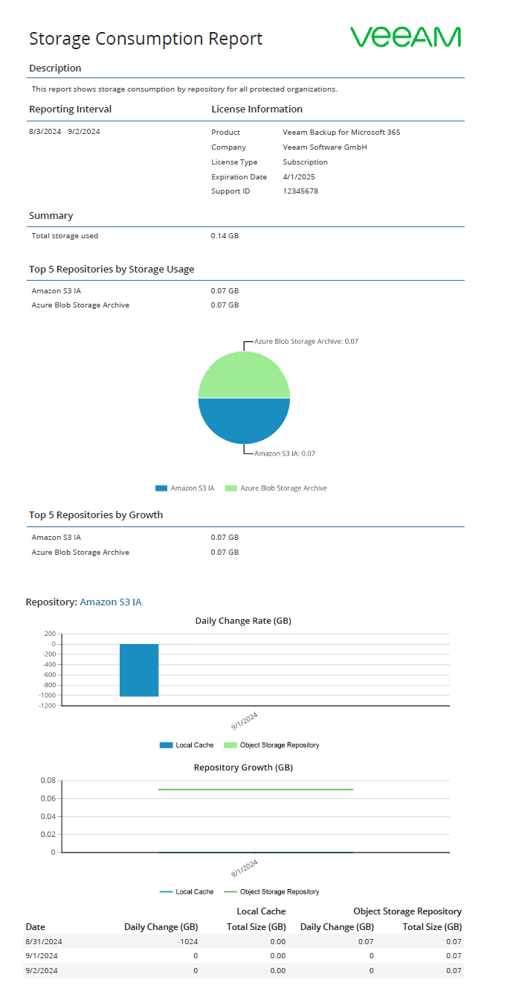
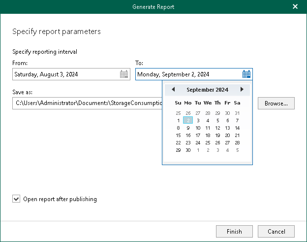

# Creating Storage Consumption Reports

The Storage Consumption reports show statistical information on used space in JET-based backup repositories and object storage repositories.

Each report consists of the following fields and shows information per repository.

| Field | Description |
| --- | --- |
| Description | Shows a description of the report. |
| Reporting Interval | Shows the time interval for which the report was generated. |
| License Information | Shows the following:   * Product name * Company name * License type * License expiration date * Support identification number |
| Summary | Shows occupied storage space of all backup repositories added to the scope. |
| Top 5 Repositories by Storage Usage | Shows top 5 repositories in which data in backups or backup copies occupies the most disk space. |
| Top 5 Repositories by Growth | Shows top 5 repositories in which the space is occupied most frequently. |
| Daily Change Rate (GB) | Information is shown per JET-based backup repositories and object storage repositories. For object storage repositories, Veeam Backup for Microsoft 365 shows the following statistical information:   * Used space that is occupied by [cache](understanding_cache.md). * Used space that is occupied by data in backups or backup copies that stored in the object storage repository. |
| Repository Growth (GB) |

Consider the following:

* Repositories that have no statistical information are not included in the report. No information is available when you added a new backup repository.

Since nothing has been placed to a backup repository after it was added, no statistical information is available, therefore, this repository is not included in the report.

* Repositories whose Daily Change and Total Size values are less than 10 MB are not included in the report.

For example, a report is said to be built starting from 09/01/2021 to 09/30/2021 and the period from 09/01/2021 to 09/09/2021 is empty (both the Daily Change and Total Size values are less than 10 MB). In this scenario, such a report will only show statistical information starting from 09/10/2021.

To generate a report, do the following:

1. Open the Organizations view.
2. In the inventory pane, select an organization.
3. On the Home tab, click Reports > Storage Consumption.

The Generate Report wizard runs.

1. Specify a time interval for reporting.
2. Click Browse to specify a location to save the report.

Use the Save as type drop-down list in the Save As dialog to select PDF or CSV format in which you want to save the report.

1. Select the Open report after publishing check box to open the generated report using the default application.
2. Click Finish.

