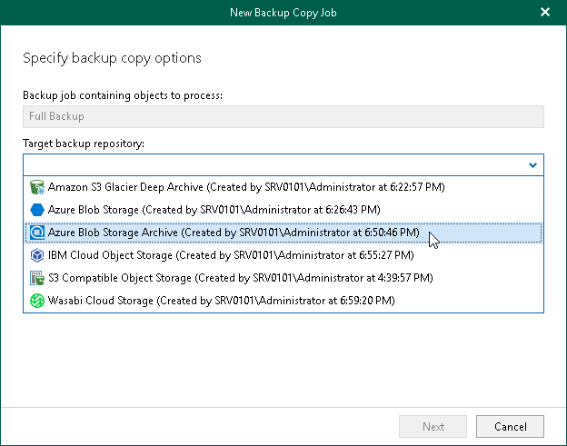

In this article

At this step of the wizard, specify an object storage repository that you want to use as a target for the backup copy job.

|  |
| --- |
| Note |
| Consider the following:   * The object storage repository where you store your backups and a target object storage repository for backup copies must be associated with the same backup proxy server or backup proxy pool and have the same retention type. * For a target object storage repository for backup copies, the immutability period equal to the retention period must be configured. |

To specify a target object storage repository, do the following:

1. In the Backup job containing objects to process field, check the backup job name.
2. From the Target backup repository drop-down list, select a target object storage repository where you want to copy your backed-up data.

Veeam Backup for Microsoft 365 will check settings of the selected target object storage repository. If a target object storage repository that you selected cannot be used to store backup copies, Veeam Backup for Microsoft 365 displays a dialog box with one of the following reasons:

* Source and target object storage repositories have different retention types.
* Source and target object storage repositories are associated with different backup proxy servers or backup proxy pools.
* The immutability period is set in days for the selected target object storage repository.

You must select another target object storage repository from the Target backup repository drop-down list.

Page updated 9/2/2024

Page content applies to build 8.3.0.2201
