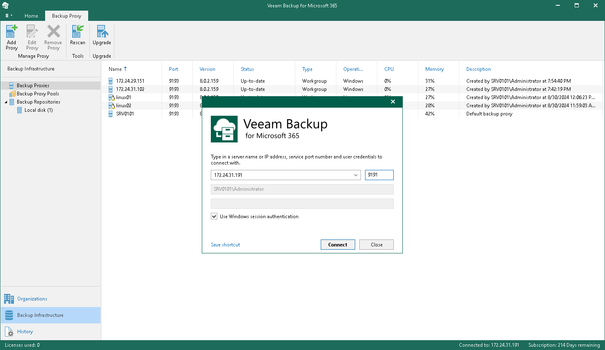

In this article

Every time you open the Veeam Backup for Microsoft 365 console, a new connection is established to the [specified Veeam Backup for Microsoft 365 server](vbo_application_launch.md). By default, after 15 minutes of idleness, such a connection is timed out. Veeam Backup for Microsoft 365 prompts you whether to re-establish a connection and continue using the product, or exit the console. For more information on how to set the idle timeout, see [Configuring Idle Timeout](manage_users_roles.md#idle_timeout).

Consider the following:

* When closing the Veeam Backup for Microsoft 365 console, all running backup and backup copy sessions will continue to be executed in the background.
* Restore sessions (if any) will not be affected.

Page updated 10/13/2025

Page content applies to build 8.3.0.2201
