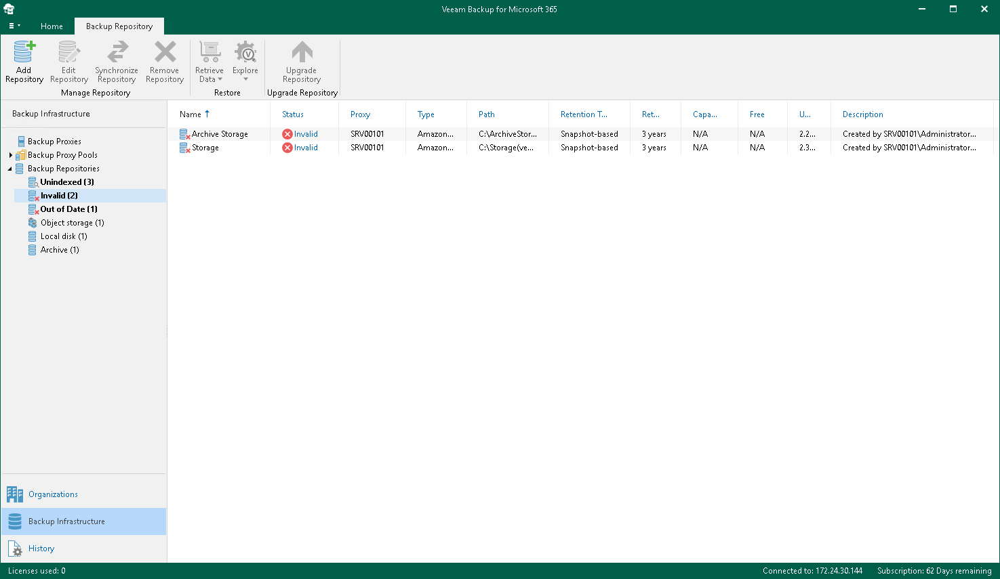

In this article

In Veeam Backup for Microsoft 365, a backup repository can be put into the Invalid state in any of the following cases:

* A repository lock in an object storage repository is missing.

A repository lock means that this object storage repository is in use by a backup proxy server or a backup proxy pool. Access to the object storage repository metadata is limited. A lock file is saved to the RepositoryLock directory. For more information, see [Object Storage Repository Structure](object_storage_structure.md).

* A trusted certificate for S3 Compatible object storage repository has been changed.

* If any of the following is true for an object storage repository:

* A connection to an object storage repository is missing.
* A container or bucket is missing or has been renamed.
* A repository folder is missing or has been renamed.

* A connection to DAS or NAS is missing.

Such an invalid backup repository becomes available after your DAS or NAS is online.

Once a repository is put into the Invalid state, back up to or restore from such a repository is impossible.

Invalid backup repositories can be found in the Backup Infrastructure view under the Backup Repositories > Invalid node.

|  |
| --- |
| Note |
| For more information on how to troubleshoot the Invalid state, see [this Veeam KB article](https://www.veeam.com/kb4468). |

Page updated 8/30/2024

Page content applies to build 8.3.0.2201
