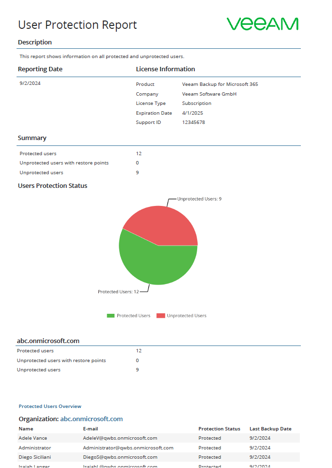
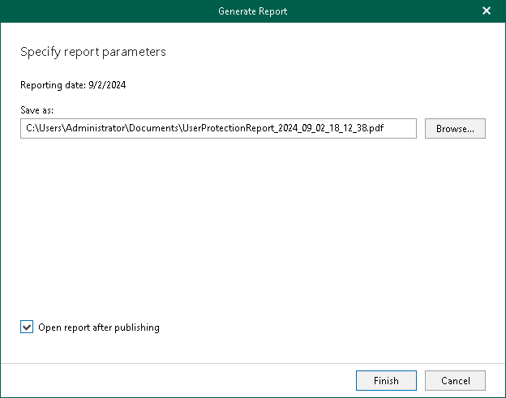

In this article

The User Protection reports show statistical information on protected and unprotected user accounts of your Microsoft 365 and on-premises Microsoft organizations.

Each report consists of the following fields and shows information per user account.

| Field | Description |
| --- | --- |
| Description | Shows a description of the report. |
| Reporting Date | Shows the date when the report was created. |
| License Information | Shows the following:   * Product name * Company name * License type * License expiration date * Support identification number |
| Summary | Shows the total number of protected and unprotected users per each organization added to the scope:   * A user is considered protected if both the user is currently added to a backup job and restore points are available for the user data in Veeam Backup for Microsoft 365. * A user is considered unprotected if the user is not added to a backup job and there are no restore points for the user data in Veeam Backup for Microsoft 365. * A user is considered unprotected with restore points if the user is not added to a backup job, but restore points are available for the user data in Veeam Backup for Microsoft 365.   Only user accounts are included in the report; group accounts are not included.  If an organization was removed from Veeam Backup for Microsoft 365, the report shows information only about users whose data was backed up.  Renamed organizations will be shown with their original names. For more information about renaming organizations, see [Renaming Organizations](vbo_rename_org.md). |

To generate a report, do the following:

1. Open the Organizations view.
2. In the inventory pane, select an organization for which you want to create a report.

|  |
| --- |
| Tip |
| You can also select the root Organizations node to generate a report for all organizations added to the scope. |

1. On the Home tab, click Reports > User Protection.

The Generate Report wizard runs.

1. Click Browse to specify a location to save the report.

Use the Save as type drop-down list in the Save As dialog to select PDF or CSV format in which you want to save the report.

1. Select the Open report after publishing check box to open the generated report using the default application.
2. Click Finish.

Page updated 9/17/2024

Page content applies to build 8.3.0.2201
