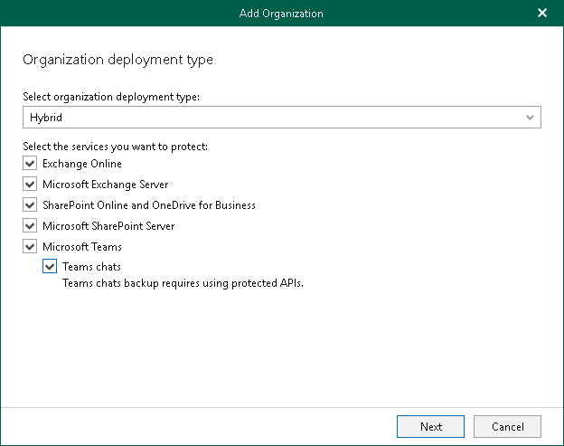

# Adding Hybrid Organizations

Veeam Backup for Microsoft 365 allows you to create hybrid configurations consisting of Microsoft 365 organizations and on-premises Microsoft Exchange/SharePoint organizations.

You can add hybrid organizations as per the following scenarios:

* Microsoft Exchange Online + on-premises Microsoft Exchange.
* Microsoft Exchange Online + on-premises Microsoft Exchange + Microsoft SharePoint Online and OneDrive for Business.
* Microsoft Exchange Online + on-premises Microsoft Exchange + Microsoft SharePoint Online and OneDrive for Business + Microsoft Teams.
* Microsoft Exchange Online + on-premises Microsoft Exchange + Microsoft SharePoint Online and OneDrive for Business + on-premises Microsoft SharePoint.
* Microsoft Exchange Online + on-premises Microsoft Exchange + Microsoft SharePoint Online and OneDrive for Business + on-premises Microsoft SharePoint + Microsoft Teams.
* Microsoft SharePoint Online and OneDrive for Business + on-premises Microsoft SharePoint.
* Microsoft Exchange Online + Microsoft SharePoint Online and OneDrive for Business + on-premises Microsoft SharePoint.
* Microsoft Exchange Online + Microsoft SharePoint Online and OneDrive for Business + on-premises Microsoft SharePoint + Microsoft Teams.

|  |
| --- |
| Note |
| Veeam Backup for Microsoft 365 backs up Microsoft Teams messages using Microsoft Graph Teams Export APIs. For more information about team chats backup, see [Team Chats Backup](vbo_object_types.md#team_chats). |

To specify Microsoft services that you want to protect in your hybrid organization at the Select Organization Deployment Type step of the wizard, select the following check boxes based on the listed scenarios:

* Exchange Online

To back up Exchange Online data.

* Microsoft Exchange Server

To back up on-premises Microsoft Exchange data.

* SharePoint Online and OneDrive for Business

To back up SharePoint Online and OneDrive for Business data.

* Microsoft SharePoint Server

To back up on-premises Microsoft SharePoint data.

* Microsoft Teams

Select this check box if you want to back up Microsoft Teams data.

You can select this check box only if both Exchange Online and SharePoint Online and OneDrive for Business check boxes are selected.

* Teams chats

Select this check box if you want to back up team chats. For more information, see [Team Chats Backup](vbo_object_types.md#team_chats).

This check box is available only if the Microsoft Teams check box is selected.

Depending on the types of services that you have selected, do the following:

* Select Microsoft Entra region and authentication method for the Microsoft 365 organization. For more information, see [Adding Microsoft 365 Organizations](vbo_add_office365_org.md).
* Specify connection settings to the on-premises Microsoft Exchange and Microsoft SharePoint servers. For more information, see [Adding On-Premises Microsoft Organizations](vbo_add_onpremises_org.md).

|  |
| --- |
| Note |
| Consider the following:   * To create a hybrid organization, services that you select must belong to the same Microsoft 365 organization. * You can use a non-MFA enabled ADFS account to add a Microsoft 365 organization. Using ADFS accounts to add on-premises Microsoft organizations is not possible. * Team chats backup is only supported for Microsoft 365 organizations with modern app-only authentication. |

