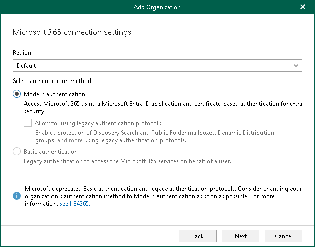

# Step 3. Select Microsoft Entra Region and Authentication Method

At this step of the wizard, select a region and authentication method.

To select a region and authentication method, do the following:

1. From the Region drop-down list, select a Microsoft Entra region your Microsoft 365 organization belongs to.
2. Select the Modern authentication option to use Microsoft Entra application to connect to your Microsoft 365 organization.

|  |
| --- |
| Note |
| Since Microsoft deprecated basic authentication and legacy authentication protocols, the Basic authentication option and the Allow for using legacy authentication protocols check box are legacy and unavailable for selection. For more information, see [this Microsoft article](https://techcommunity.microsoft.com/t5/exchange-team-blog/basic-authentication-deprecation-in-exchange-online-september/ba-p/3609437). |

