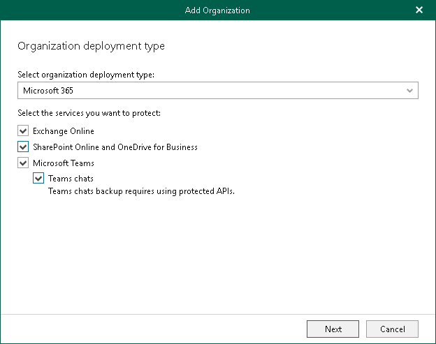

# Step 2. Select Organization Deployment Type

At this step of the wizard, select a deployment type and Microsoft Online services whose data you want to protect.

|  |
| --- |
| Note |
| Veeam Backup for Microsoft 365 backs up Microsoft Teams messages using Microsoft Graph Teams Export APIs. For more information about team posts (formerly team chats) backup, see [Team Posts Backup](vbo_object_types.md#team_posts). |

To select an organization deployment type and Microsoft Online services whose data you want to protect, do the following:

1. From the Select organization deployment type drop-down list, select Microsoft 365.
2. If you want to back up Exchange Online data, select the Exchange Online check box.
3. If you want to back up SharePoint Online and OneDrive data, select the SharePoint Online and OneDrive check box.
4. If you want to back up Microsoft Teams data, select the Microsoft Teams check box.

You can select this check box only if both Exchange Online and SharePoint Online and OneDrive check boxes are selected.

1. If you want to back up team posts, select the Teams posts check box.

This check box is available only if the Microsoft Teams check box is selected. For more information about team posts backup, see [Team Posts Backup](vbo_object_types.md#team_posts).

|  |
| --- |
| Note |
| Consider the following:   * Microsoft Teams service is not supported for organizations in Microsoft Entra China region. * Team posts backup is not supported for Microsoft organizations in Microsoft Entra China, US Government DOD and US Government GCC High regions. |

