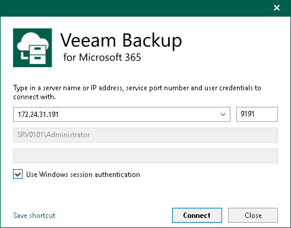

In this article

To launch Veeam Backup for Microsoft 365 Console, do the following:

1. From the Start menu, select Veeam Backup for Microsoft 365.
2. In the displayed window, do the following:

1. Enter a name or IP address of the Veeam Backup for Microsoft 365 server or select it from the list of recent connections.
2. Specify a port number which is used to connect to the Veeam Backup for Microsoft 365 server. By default, port 9191 is used.
3. Enter authentication credentials of the user account that you want to use to connect to the specified Veeam Backup for Microsoft 365 server.

Keep in mind that the account you are using must be a member of the local Administrators group on the specified Veeam Backup for Microsoft 365 server or have been assigned the Veeam Backup Administrator role. For more information, see [Managing Users and Roles](manage_users_roles.md).

You can also select the Use Windows session authentication check box. In this case, you will log in to Veeam Backup for Microsoft 365 using your current account.

1. If you want to save a connection shortcut to the desktop, click Save shortcut in the lower-left corner.
2. Click Connect.

If multi-factor authentication (MFA) is enabled, after you click Connect, you will get the instruction how to set up MFA or have to enter a 6-digit confirmation code generated in the mobile authenticator application. For more information, see [Multi-Factor Authentication](mfa.md).

Launching with Command Line

To launch Veeam Backup for Microsoft 365 using the command-line tool, run the C:\Program Files\Veeam\Backup365\Veeam.Archiver.Shell.exe file with the following parameters:

* /local=true

To connect to Veeam Backup for Microsoft 365 that is installed on a local machine using the Local System account.

For example:

|  |
| --- |
| C:\Program Files\Veeam\Backup365\Veeam.Archiver.Shell.exe /local=true |

* /host=<hostname> /port=<port> /usewincredentials=true

To connect to Veeam Backup for Microsoft 365 that is installed on a remote machine using the /host and /port parameters.

For example:

|  |
| --- |
| C:\Program Files\Veeam\Backup365\Veeam.Archiver.Shell.exe /host=192.168.0.12 /port=9895 /usewincredentials=true |

* /host=<host> /port=<port> /account=<domain\accountName>

To connect to Veeam Backup for Microsoft 365 that is installed on a remote machine using the /host and /port parameters.

You can also provide an account that you want to use to launch Veeam Backup for Microsoft 365 using the /account=<domain\accountName> format.

For example:

|  |
| --- |
| C:\Program Files\Veeam\Backup365\Veeam.Archiver.Shell.exe /host=192.168.0.12 /port=9895 /account=tech.local\Administrator |

In This Section

* [User Interface](vbo_know_ui.md)
* [Current Session](understanding_current_session.md)
* [Performing Search](org_search.md)

Page updated 8/28/2024

Page content applies to build 8.3.0.2201
