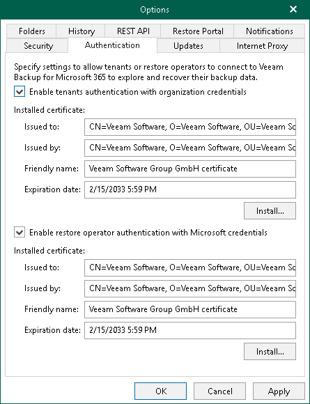

# Authentication Settings

You can configure authentication settings to the Veeam Backup for Microsoft 365 server for tenants and restore operators.

Authentication to the Veeam Backup for Microsoft 365 server is required for them to connect to Veeam Backup for Microsoft 365 and perform restore operations within the following usage scenarios:

* Backup as a Service with Veeam Backup for Microsoft 365. In this scenario, tenants authenticate to Veeam Backup for Microsoft 365 server with Microsoft organization credentials.

Enabling tenant authentication is required for users from tenant organizations to view and restore backups that are located on the service provider side. For more information, see [Enabling tenant authentication](#tenants).

* Operator restore. In this scenario, restore operators authenticate to Veeam Backup for Microsoft 365 with their Microsoft 365 credentials. Restore operators use Restore Portal to view and restore data from backups created by Veeam Backup for Microsoft 365 for other users, groups, sites, teams or the entire Microsoft 365 organization.

Enabling restore operator authentication is required if you want to configure Restore Portal. For more information, see [Enabling restore operator authentication](#restore_operator).

|  |
| --- |
| Note |
| To configure access to Veeam Backup for Microsoft 365 for users and restore operators from multiple tenant organizations, you must enable both options. |

Enabling Tenant Authentication

To enable tenant authentication, do the following:

1. In the main menu, click General Options.
2. Open the Authentication tab.
3. Select the Enable tenants authentication with organization credentials check box.
4. Click Install to run the Select Certificate wizard.
5. Proceed to any of the following options:

* [Generate a new self-signed certificate](vbo_installing_certificate.md#generate_new)

* [Select certificate from the Certificate Store of this server](vbo_installing_certificate.md#selecting_file)
* [Import certificate from a PFX file](vbo_installing_certificate.md#import)

1. Click OK.

|  |
| --- |
| Tip |
| You can use the same certificate for both Veeam Backup for Microsoft 365 and Veeam Backup & Replication. |

Enabling Restore Operator Authentication

To enable restore operator authentication, do the following:

1. In the main menu, click General Options.
2. Open the Authentication tab.
3. Select the Enable restore operator authentication with Microsoft credentials check box.
4. Click Install to run the Select Certificate wizard.
5. Proceed to any of the following options:

* [Generate a new self-signed certificate](vbo_installing_certificate.md#generate_new)

* [Select certificate from the Certificate Store of this server](vbo_installing_certificate.md#selecting_file)
* [Import certificate from a PFX file](vbo_installing_certificate.md#import)

Veeam Backup for Microsoft 365 will use this certificate to encrypt network traffic between Veeam Backup for Microsoft 365 Service and Veeam Backup for Microsoft 365 REST API Service.

|  |
| --- |
| Note |
| If you have installed the Veeam Backup for Microsoft 365 REST API component on a separate machine and generated a new self-signed certificate for restore operators, you must import this certificate to the Trusted Root Certification Authorities certificate store on the separate machine with REST API installed. |

1. Click OK.

Related Topics

* [Restore Portal Settings](vbo_restore_portal_settings.md)
* [Configuring REST API and Restore Portal on Separate Machine](vbo_configuring_rest_separate.md)
* [Backup as Service with Veeam Backup for Microsoft 365](vbo_mail_baas.md)
* [Data Restore Using Restore Portal](ssp_restore.md)

