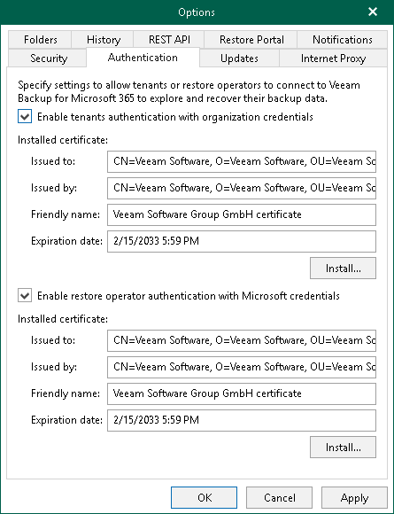

# Enabling Tenant Authentication

Enabling tenant authentication is required for users from tenant organizations to view and restore backups that are located on the service provider side. To connect to Veeam Backup for Microsoft 365 and perform restore operations, tenants authenticate to the Veeam Backup for Microsoft 365 server with Microsoft organization credentials.

To enable tenant authentication, do the following:

1. In the main menu, click General Options.
2. Open the Authentication tab.
3. Select the Enable tenants authentication with organization credentials check box.
4. Click Install to run the Select Certificate wizard and install the tenant authentication certificate. Proceed to any of the following options:

Generate a new self-signed certificate

|  |
| --- |
| Perform the following steps:   1. Select the Generate a new self-signed certificate option.      1. Specify a certificate name and click Finish.    |

Import an existing TLS certificate from the certificate store

|  |  |  |
| --- | --- | --- |
| Perform the following steps:   1. Select the Select certificate from the Certificate Store of this server option.      1. Select the certificate from the certificate store and click Finish.   |  | | --- | | Note | | A TLS certificate that you want to use must be added to the Personal certificate store. It also must have a private exportable key. |   |

Import a TLS certificate from a file in the PFX format

|  |  |  |
| --- | --- | --- |
| Perform the following steps:   1. Select the Import certificate from a PFX file option.      1. Click Browse and select a PFX file. Specify the certificate password if required.   |  | | --- | | Note | | A TLS certificate that you want to use must have a private exportable key. |     1. Click Finish. |

|  |
| --- |
| Tip |
| You can use the same certificate for both Veeam Backup for Microsoft 365 and Veeam Backup & Replication. |

1. Click OK.

