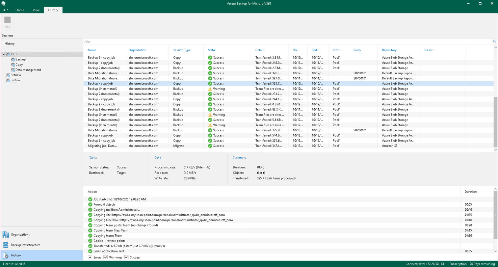

In this article

Veeam Backup for Microsoft 365 saves results and metrics of each backup, backup copy, retrieve, restore or data management session in the Veeam Backup for Microsoft 365 configuration database.

To review backup, backup copy, retrieve, restore and data management sessions, open the History view and select one of the following nodes:

* Jobs. To see all backup, backup copy and data management sessions.

* Backup. To see both completed and running backup sessions.
* Copy. To see both completed and running backup copy sessions.
* Data Management. To see both completed and running data management sessions.

* Retrieve. To see both completed and running retrieve sessions.
* Restore. To see Veeam Explorers restore sessions.

To stop a running session, select it in the preview pane and click Stop on the ribbon. For more information, see [Stopping Backup Job](stopping_backup_job.md) and [Stopping Backup Copy Job](stopping_backup_copy_job.md).

To review a specific session results of only particular type, use the Success, Warnings or Errors check boxes at the bottom.

In This Section

* [Viewing Backup and Backup Copy Session Metrics](backup_metrics.md)
* [Viewing Data Management Session Metrics](migration_metrics.md)
* [Viewing Retrieve Session Metrics](retrieve_metrics.md)
* [Viewing Restore Session Metrics](restore_metrics.md)
* [Performing Search](history_search.md)

Page updated 10/14/2025

Page content applies to build 8.3.0.2201
