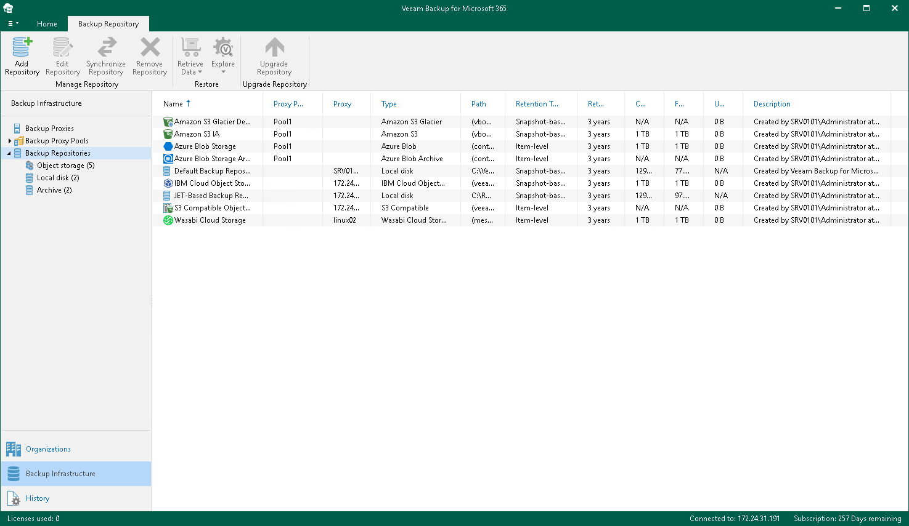

In this article

Veeam Backup for Microsoft 365 uses backup repositories as storage systems for [backups](vbo_data_backup.md) and [backup copies](vbo_backup_copy.md) created for Microsoft 365 and on-premises Microsoft organizations. You can add to Veeam Backup for Microsoft 365 storage systems of the following types:

* [JET-based backup repository](jet_backup_repo.md)

You can use JET-based backup repositories only for data backup.

* [Object storage repository](vbo_osr.md)

You can use object storage repositories for both data backup and backup copy.

The following table lists supported backup repositories depending on their type and purpose of usage:

|  | JET-based backup repository | Object storage repository |
| --- | --- | --- |
| Data backup | ✔ | ✔ |
| Backup copy |  | ✔ |

For more information about Azure Blob Storage and Amazon S3 object storage repositories supported by Veeam Backup for Microsoft 365, see [Supported Azure Storage Account Types](supported_storage_account_types.md) and [Supported Amazon S3 Storage Classes](supported_storage_classes_amazon.md).

Veeam Backup for Microsoft 365 creates and maintains different structures for JET-based backup repositories and object storage repositories. For more information about the structure for JET-based backup repositories, see [JET-Based Backup Repository Structure](br_structure.md). For more information about the structure for object storage repositories, see [Object Storage Repository Structure](object_storage_structure.md).

What Is Under Backup Repositories Node

In the Backup Infrastructure view, the Backup Repositories node includes the following nodes for different backup repositories added to Veeam Backup for Microsoft 365:

* Object storage. Contains object storage repositories: S3 Compatible object storage repositories, Azure Blob Storage Hot/Cool access tiers, Amazon S3 Standard, Amazon S3 Standard-Infrequent Access and Amazon S3 One Zone-Infrequent Access storage classes. Veeam Backup for Microsoft 365 uses these object storage repositories for both data backup and backup copy.
* Local disk. Contains Default Backup Repository and other JET-based backup repositories. Veeam Backup for Microsoft 365 uses these backup repositories only for data backup.
* Archive. Contains Azure Blob Storage Archive access tier and all Amazon S3 Glacier storage classes. Veeam Backup for Microsoft 365 uses these object storage repositories only for backup copy.

Keep in mind that the Archive and Object storage nodes are displayed only if you have added a particular object storage repository.

In This Section

* [Retention Policy](retention_policy.md)
* [JET-Based Backup Repositories](jet_backup_repo.md)
* [Object Storage Repositories](vbo_osr.md)
* [Editing Backup Repository Settings](vbo_editing_repository.md)
* [Upgrading Backup Repositories](vbo_upgrading_repository.md)
* [Indexing Backup Repositories](indexing.md)
* [Removing Backup Repositories](vbo_removing_repository.md)
* [Invalid State](understanding_invalid_state.md)

Page updated 9/26/2024

Page content applies to build 8.3.0.2201
