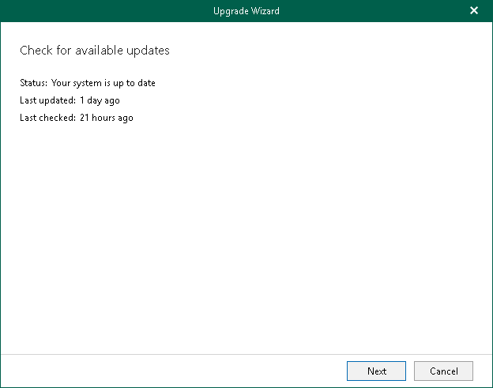
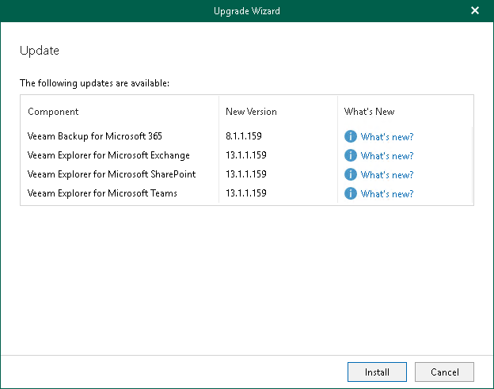

In this article

To update Veeam Backup for Microsoft 365 and Veeam Explorers manually, do the following:

1. In the main menu, click Upgrade.
2. In the Check for available updates step, click Next.

Make sure to open the port that is required to access the Veeam auto-update server. For more information, see [Ports](vbo_used_ports.md).

1. Wait until Veeam Backup for Microsoft 365 checks whether a newer version is available.

To abort the request, click Cancel.

1. If available, click the What's new links to review details about new features and enhancements of Veeam Backup for Microsoft 365 and Veeam Explorers and click Install.

During update, the Veeam Backup for Microsoft 365 console will be closed, and you will be offered to go through the setup steps. For more information, see [Installing Veeam Backup for Microsoft 365](vbo_installing_vbo.md).

1. Once installation is complete, launch Veeam Backup for Microsoft 365. For more information, see [Launching Veeam Backup for Microsoft 365](vbo_application_launch.md).

|  |
| --- |
| Note |
| You can configure whether Veeam Backup for Microsoft 365 will notify you when new versions appear on Veeam servers and allow Veeam Backup for Microsoft 365 to download available updates automatically. For more information, see [New Versions and Automatic Updates](vbo_configuring_update.md). |

Page updated 8/28/2025

Page content applies to build 8.3.0.2201
