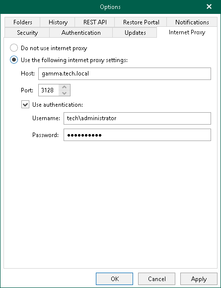

In this article

If a server on which Veeam Backup for Microsoft 365 is deployed does not have a direct access to the internet, you can assign an internet proxy server to be used as a gateway.

|  |
| --- |
| Note |
| When you allow Veeam Backup for Microsoft 365 to use internet proxy and you configure new connection settings to an internet proxy server, the product overwrites the system proxy settings for Microsoft Windows HTTP Services (WinHTTP). |

To enable usage of an internet proxy server, do the following:

1. In the main menu, click General Options.
2. Open the Internet Proxy tab.
3. Select the Use the following internet proxy settings option.
4. In the Host field, specify a server that has access to the internet and which you want to use as your internet proxy.

You can provide a DNS or IP address of a server.

1. In the Port field, provide a port number over which to connect to the specified server.
2. Select the Use authentication check box to provide authentication credentials to access the internet proxy server.
3. Click OK.

|  |
| --- |
| Tip |
| Also, you can configure an internet proxy server for each of your backup proxy servers. For more information, see [Configuring Internet Proxy Server](vbo_internet_proxy.md). |

To disable usage of the internet proxy server, do the following:

1. In the main menu, click General Options.
2. Open the Internet Proxy tab.
3. Select the Do not use internet proxy option.

|  |
| --- |
| Note |
| After you disable usage of the internet proxy, you must reset the WinHTTP settings. To do this, open the Command Prompt and run the netsh winhttp reset proxy command. |

Page updated 8/27/2024

Page content applies to build 8.3.0.2201
