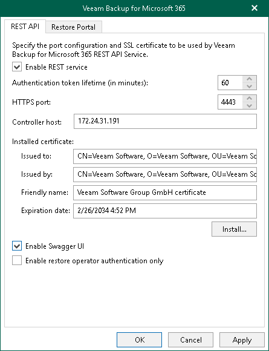
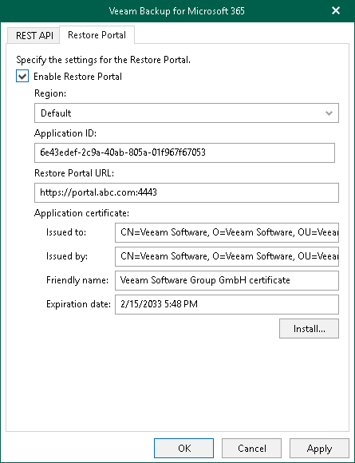

In this article

To configure REST API and Restore Portal on a separate machine, do the following:

1. Open the Veeam Backup for Microsoft 365 REST API component installation folder.

By default, Veeam Backup for Microsoft 365 REST API component is installed to the C:\Program Files\Veeam\Backup365 folder.

1. Run the Veeam.Archiver.REST.Configurator.exe file.

The Veeam Backup for Microsoft 365 window opens.

1. Configure REST API settings. For more information, see [Configuring REST API Settings](#rest).
2. Configure Restore Portal settings. For more information, see [Configuring Restore Portal Settings](#ssp).
3. Click Apply.
4. Click OK to close the Veeam Backup for Microsoft 365 window.

Configuring REST API Settings

On the REST API tab, do the following:

1. Select the Enable REST service check box.
2. In the Authentication token lifetime field, specify the lifetime value for an authentication token (in minutes).

REST API authorization is based on the [OAuth 2.0 Authorization Framework](https://datatracker.ietf.org/doc/html/rfc6749).

1. In the HTTPS port field, specify a port number which Veeam Backup for Microsoft 365 use to access Veeam Backup for Microsoft 365 REST API Service.
2. In the Controller host field, specify a DNS name or IP address of the Veeam Backup for Microsoft 365 server.
3. Click Install to run the Select Certificate wizard.
4. Proceed to any of the following options:

* [Generate a new self-signed certificate](vbo_installing_certificate.md#generate_new)

* [Select certificate from the Certificate Store of this server](vbo_installing_certificate.md#selecting_file)
* [Import certificate from a PFX file](vbo_installing_certificate.md#import)

|  |
| --- |
| Note |
| If you have generated a new [self-signed certificate for restore operators](vbo_authentication_settings.md#restore_operator), you must import the certificate for restore operators to the Trusted Root Certification Authorities certificate store on the separate machine with REST API installed. |

1. Select the Enable Swagger UI check box to enable access to the swagger website and usage of Swagger UI.
2. Select the Enable restore operator authentication only check box to use REST API only for authentication of restore operators to Restore Portal. Keep in mind that if you enable this check box, all other REST API endpoints will be unavailable.

Configuring Restore Portal Settings

On the Restore Portal tab, do the following:

1. Select the Enable Restore Portal check box.
2. From the Region drop-down list, select a Microsoft Entra region.

Keep in mind that if you change your Microsoft Entra region, you must also specify another Microsoft Entra application.

1. In the Application ID field, specify an identification number of Microsoft Entra application that you want to use to access Restore Portal.

You can find this identification number in the application settings of your Microsoft Entra ID. For more information, see [this Microsoft article](https://docs.microsoft.com/en-us/azure/active-directory/develop/howto-create-service-principal-portal). Make sure to manually grant the [required permissions](ssp_ad_application_permissions.md) to your Microsoft Entra application.

1. In the Restore Portal URL field, specify web address of a machine with the Veeam Backup for Microsoft 365 REST API component installed. Restore operators and end users will use this web address to open Restore Portal in a web browser window.

Consider the following:

* The website is available over HTTPS protocol only.
* By default, port 4443 must be opened on the Veeam Backup for Microsoft 365 server or a machine with the Veeam Backup for Microsoft 365 REST API component installed. For more information, see [Ports](vbo_used_ports.md).
* The web address must be specified in one of the following formats:

* https://<IPv4 address>:<port number>, where <IPv4 address> is a public IPv4 address of a machine with the Veeam Backup for Microsoft 365 REST API component installed. For example, https://135.169.170.192:4443.
* https://<DNS hostname>:<port number>, where <DNS hostname> is DNS host name of a machine with the Veeam Backup for Microsoft 365 REST API component installed. For example, https://portal.abc.com:4443.

1. In the Application certificate section, click Install to specify an SSL certificate that you want to use for data exchange between Restore Portal and the specified Microsoft Entra application.

You can generate a new self-signed certificate or use an existing one. When generating a new self-signed certificate, Veeam Backup for Microsoft 365 will register it in Microsoft Entra ID automatically. Before using an existing certificate, make sure to register this certificate in Microsoft Entra ID. For more information, see [this Microsoft article](https://docs.microsoft.com/en-us/azure/active-directory/develop/howto-create-service-principal-portal#certificates-and-secrets).

1. In the Select Certificate wizard, proceed to any of the following options:

* [Generate a new self-signed certificate](vbo_installing_certificate.md#generate_new)

* [Select certificate from the Certificate Store of this server](vbo_installing_certificate.md#selecting_file)
* [Import certificate from a PFX file](vbo_installing_certificate.md#import)

|  |
| --- |
| Note |
| If you generated a new self-signed certificate for the specified Microsoft Entra application, you must add this certificate in the application settings of your Microsoft Entra ID. |

Page updated 4/30/2025

Page content applies to build 8.3.0.2201
