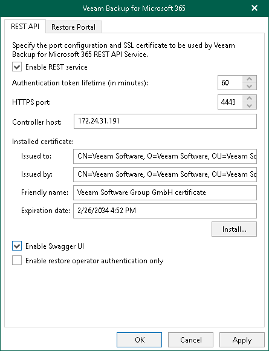

# Configuring REST API Settings

On the REST API tab, do the following:

1. Select the Enable REST service check box.
2. In the Authentication token lifetime field, specify the lifetime value for an authentication token (in minutes).

REST API authorization is based on the [OAuth 2.0 Authorization Framework](https://datatracker.ietf.org/doc/html/rfc6749).

1. In the HTTPS port field, specify a port number which Veeam Backup for Microsoft 365 use to access Veeam Backup for Microsoft 365 REST API Service.
2. In the Controller host field, specify a DNS name or IP address of the Veeam Backup for Microsoft 365 server.
3. Click Install to run the Select Certificate wizard and install the REST API certificate. Proceed to any of the following options:

Generate a new self-signed certificate

|  |
| --- |
| Perform the following steps:   1. Select the Generate a new self-signed certificate option.      1. Specify a certificate name and click Finish.    |

Import an existing TLS certificate from the certificate store

|  |  |  |
| --- | --- | --- |
| Perform the following steps:   1. Select the Select certificate from the Certificate Store of this server option.      1. Select the certificate from the certificate store and click Finish.   |  | | --- | | Note | | A TLS certificate that you want to use must be added to the Personal certificate store. It also must have a private exportable key. |   |

Import a TLS certificate from a file in the PFX format

|  |  |  |
| --- | --- | --- |
| Perform the following steps:   1. Select the Import certificate from a PFX file option.      1. Click Browse and select a PFX file. Specify the certificate password if required.   |  | | --- | | Note | | A TLS certificate that you want to use must have a private exportable key. |     1. Click Finish. |

|  |
| --- |
| Note |
| If you have generated a new [self-signed certificate for restore operators](vbo_authentication_settings_restore_operators.md), you must import the certificate for restore operators to the Trusted Root Certification Authorities certificate store on the separate machine with REST API installed. |

1. If you want to use Swagger UI, select the Enable Swagger UI check box. If you do not require permanent access, leave the check box clear to reduce the potential attack surface.
2. Select the Enable restore operator authentication only check box to use REST API only for authentication of restore operators to Restore Portal. Keep in mind that if you enable this check box, all other REST API endpoints will be unavailable.

