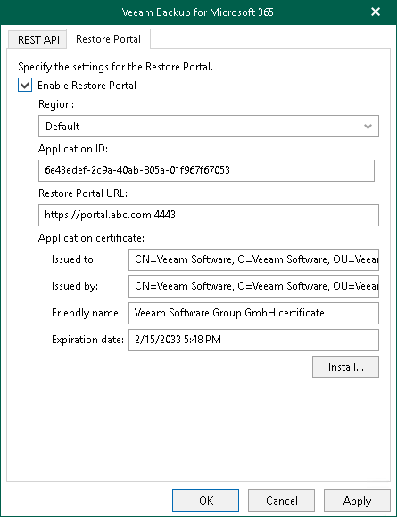

# Configuring Restore Portal Settings

On the Restore Portal tab, do the following:

1. Select the Enable Restore Portal check box.
2. From the Region drop-down list, select a Microsoft Entra region.

Keep in mind that if you change your Microsoft Entra region, you must also specify another Microsoft Entra application.

1. In the Application ID field, specify an identification number of Microsoft Entra application that you want to use to access Restore Portal.

You can find this identification number in the application settings of your Microsoft Entra ID. For more information, see [this Microsoft article](https://docs.microsoft.com/en-us/azure/active-directory/develop/howto-create-service-principal-portal). Make sure to manually grant the [required permissions](ssp_ad_application_permissions.md) to your Microsoft Entra application.

1. In the Restore Portal URL field, specify web address of a machine with the Veeam Backup for Microsoft 365 REST API component installed. Restore operators and end users will use this web address to open Restore Portal in a web browser window.

Consider the following:

* The website is available over HTTPS protocol only.
* By default, port 4443 must be opened on the Veeam Backup for Microsoft 365 server or a machine with the Veeam Backup for Microsoft 365 REST API component installed. For more information, see [Ports](vbo_used_ports.md).
* The web address must be specified in one of the following formats:

* https://<IPv4 address>:<port number>, where <IPv4 address> is a public IPv4 address of a machine with the Veeam Backup for Microsoft 365 REST API component installed. For example, https://135.169.170.192:4443.
* https://<DNS hostname>:<port number>, where <DNS hostname> is DNS host name of a machine with the Veeam Backup for Microsoft 365 REST API component installed. For example, https://portal.abc.com:4443.

1. In the Application certificate section, click Install to specify a TLS certificate that you want to use for data exchange between Restore Portal and the specified Microsoft Entra application.

You can generate a new self-signed certificate or use an existing one. When generating a new self-signed certificate, Veeam Backup for Microsoft 365 will register it in Microsoft Entra ID automatically. Before using an existing certificate, make sure to register this certificate in Microsoft Entra ID. For more information, see [this Microsoft article](https://docs.microsoft.com/en-us/azure/active-directory/develop/howto-create-service-principal-portal#certificates-and-secrets).

1. In the Select Certificate wizard, proceed to any of the following options:

Generate a new self-signed certificate

|  |
| --- |
| Perform the following steps:   1. Select the Generate a new self-signed certificate option.      1. Specify a certificate name and click Finish.    |

Import an existing TLS certificate from the certificate store

|  |  |  |
| --- | --- | --- |
| Perform the following steps:   1. Select the Select certificate from the Certificate Store of this server option.      1. Select the certificate from the certificate store and click Finish.   |  | | --- | | Note | | A TLS certificate that you want to use must be added to the Personal certificate store. It also must have a private exportable key. |   |

Import a TLS certificate from a file in the PFX format

|  |  |  |
| --- | --- | --- |
| Perform the following steps:   1. Select the Import certificate from a PFX file option.      1. Click Browse and select a PFX file. Specify the certificate password if required.   |  | | --- | | Note | | A TLS certificate that you want to use must have a private exportable key. |     1. Click Finish. |

|  |
| --- |
| Note |
| If you generated a new self-signed certificate for the specified Microsoft Entra application, you must add this certificate in the application settings of your Microsoft Entra ID. |

