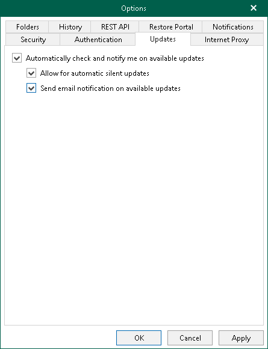

In this article

You can configure whether Veeam Backup for Microsoft 365 will notify you when new versions appear on Veeam servers and allow Veeam Backup for Microsoft 365 to download available updates automatically.

To configure notifications on new versions and automatic updates, do the following:

1. In the main menu, click General Options.
2. Open the Updates tab.
3. Select the Automatically check and notify me on available updates check box.

If you select this check box, Veeam Backup for Microsoft 365 will notify you about available updates with a dialog message in the user interface.

1. Select the following check boxes:

* Allow for automatic silent updates. If you select this check box, Veeam Backup for Microsoft 365 will regularly check Veeam servers for critical updates. If a new critical update is available, Veeam Backup for Microsoft 365 will notify you about available update with an email message, download this update in the background and install it to the backup infrastructure components.
* Send email notification on available updates. If you select this check box, Veeam Backup for Microsoft 365 will notify you about available updates with an email message.

For sending email notifications, Veeam Backup for Microsoft 365 uses the email notification settings. For more information, see [Notification Settings](vbo_notification_settings.md).

1. Click OK.

|  |
| --- |
| Tip |
| For information on how to update Veeam Backup for Microsoft 365, see [Updating Veeam Backup for Microsoft 365](vbo_updating.md). |

Page updated 8/30/2024

Page content applies to build 8.3.0.2201
