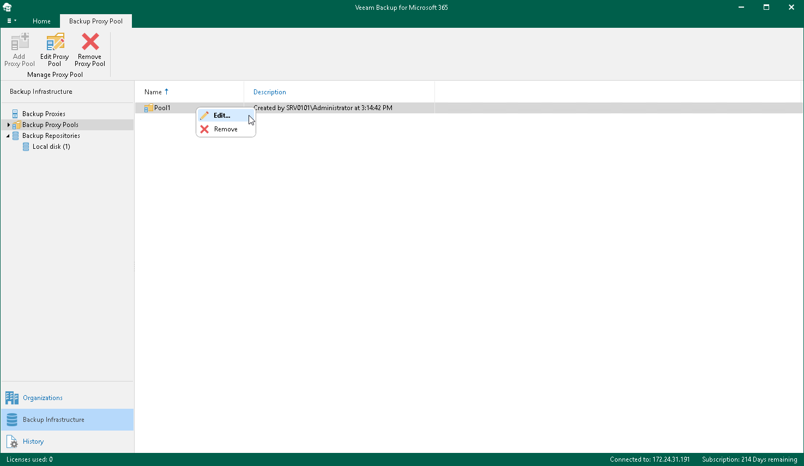

# Editing Backup Proxy Pool Settings

Veeam Backup for Microsoft 365 allows you to edit settings of your backup proxy pool.

To edit backup proxy pool settings, do the following:

1. Open the Backup Infrastructure view.
2. In the inventory pane, select the Backup Proxy Pools node.
3. In the preview pane, do one of the following:

* Select a backup proxy pool and click Edit Proxy Pool on the ribbon.

* Right-click a backup proxy pool and select Edit.

1. Modify the required settings.

You can change the following parameters:

* The backup proxy pool name and description.
* The list of backup proxy servers added to the backup proxy pool. You can do the following:

* Add more backup proxy servers to the backup proxy pool. For more information, see [Select Backup Proxy Servers](add_proxy_pool_select_proxies.md).
* Remove active backup proxy servers from the backup proxy pool. For more information, see [Removing Backup Proxy Servers from Backup Proxy Pool](#remove_proxy_from_pool).

Removing Backup Proxy Servers from Backup Proxy Pool

You can remove active backup proxy servers from the backup proxy pool at any time.

|  |
| --- |
| Important |
| Removing backup proxy servers that you have put under maintenance is impossible. |

The process of removing a backup proxy server from the backup proxy pool involves the following steps:

1. Veeam Backup for Microsoft 365 re-assigns execution of backup operations to the remaining active backup proxy servers within the backup proxy pool.
2. Veeam Backup for Microsoft 365 removes the logical affiliation of the backup proxy server to the backup proxy pool.

|  |
| --- |
| Note |
| You cannot remove all backup proxy servers from the backup proxy pool. Veeam Backup for Microsoft 365 requires to keep active at least one backup proxy server per backup proxy pool. |

To remove backup proxy servers from the backup proxy pool, [edit the backup proxy pool settings](#edit), select backup proxy servers that you want to remove in the list of backup proxy servers and click Remove.

Related Topics

[Adding Backup Proxy Pools](vbo_add_proxy_pool.md)

