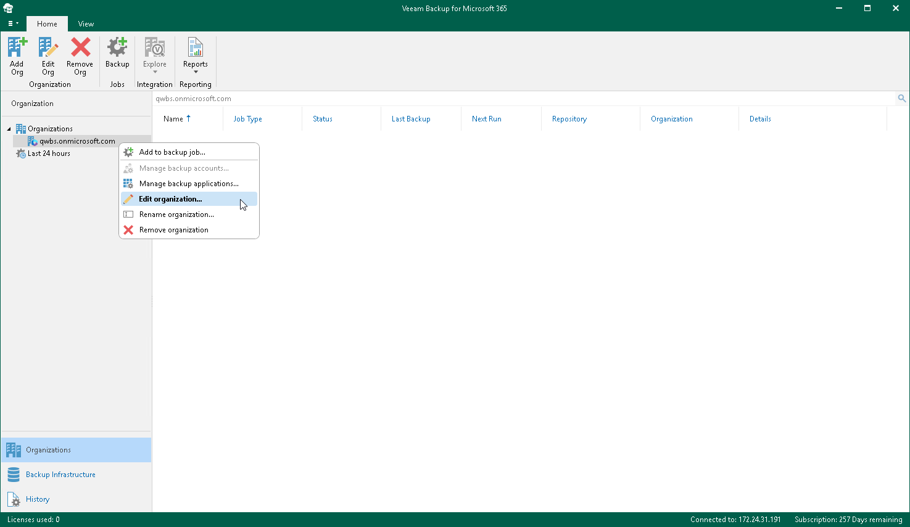

In this article

Veeam Backup for Microsoft 365 allows you to edit a Microsoft organization settings.

To edit a Microsoft organization settings, do the following:

1. Open the Organizations view.
2. In the inventory pane, select an organization.
3. Do one of the following:

* On the Home tab, click Edit Org on the ribbon.
* Right-click an organization and select Edit organization.

1. Modify the required settings.

You can edit the following organization settings:

* Organization deployment type.

Consider that you cannot change the Microsoft 365 organization deployment type to the On-premises type.

* Services that you want to protect.
* Microsoft Entra region and authentication method.

|  |
| --- |
| Note |
| After upgrading Veeam Backup for Microsoft 365 to version 8 from the previous versions of the product, you may have in the Veeam Backup for Microsoft 365 console Microsoft 365 organizations that use basic authentication or modern authentication with legacy protocols allowed. Since Microsoft deprecated basic authentication and legacy authentication protocols, it is recommended to change the authentication method to modern app-only authentication for such organizations. For more information, see [What You Do After Upgrade](after_upgrade.md#modern_app-only). |

* User name and password.

Related Topics

* [Adding Microsoft 365 Organizations](vbo_add_office365_org.md)
* [Adding On-Premises Microsoft Organizations](vbo_add_onpremises_org.md)
* [Adding Hybrid Organizations](vbo_add_hybrid.md)

Page updated 8/23/2024

Page content applies to build 8.3.0.2201
