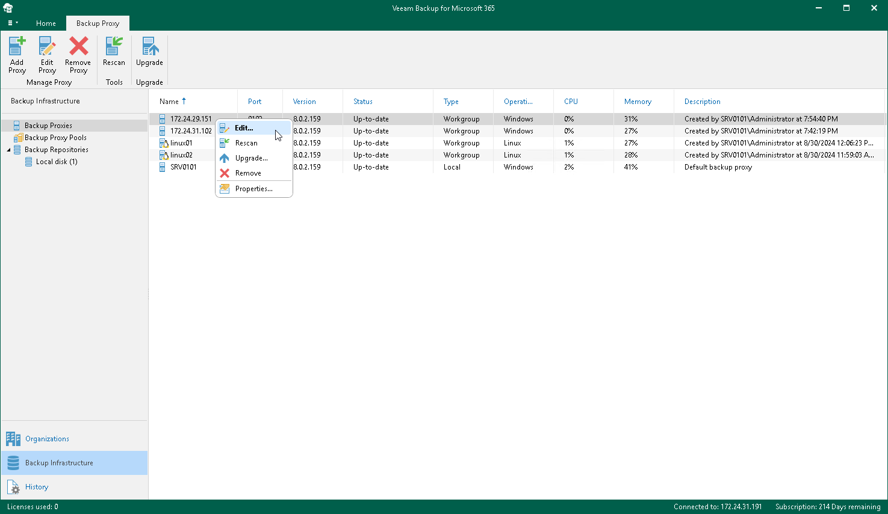

In this article

Veeam Backup for Microsoft 365 allows you to edit settings of your backup proxy server. Actually, when you edit backup proxy server settings, you add the backup proxy anew to the Veeam Backup for Microsoft 365 backup infrastructure with modified settings.

Consider the following:

* Editing a proxy server name is prohibited once it is set.
* The Edit command is unavailable if a backup proxy server needs to be upgraded. For more information, see [Upgrading Backup Proxy Servers](vbo_upgrading_proxy_server.md).
* For Windows-based backup proxy servers, you cannot change the type of a backup proxy server from the domain backup proxy to the workgroup backup proxy and vice versa.
* You cannot change the service account to run Veeam Backup for Microsoft 365 Proxy Service.

To edit backup proxy server settings, do the following:

1. Open the Backup Infrastructure view.
2. In the inventory pane, select the Backup Proxies node.
3. In the preview pane, do one of the following:

* Select a backup proxy server and click Edit Proxy on the ribbon.

* Right-click a backup proxy server and select Edit.

1. Modify the required settings.

You can change the following parameters:

* The port number to access the backup proxy server computer.
* Description.
* User account credentials to connect to a Windows-based backup proxy server.
* The SSH connection settings for a Linux-based backup proxy server.

Related Topics

* [Adding Windows-Based Backup Proxy Server](add_win_proxy.md)
* [Adding Linux-Based Backup Proxy Server](add_linux_proxy.md)

Page updated 8/30/2024

Page content applies to build 8.3.0.2201
