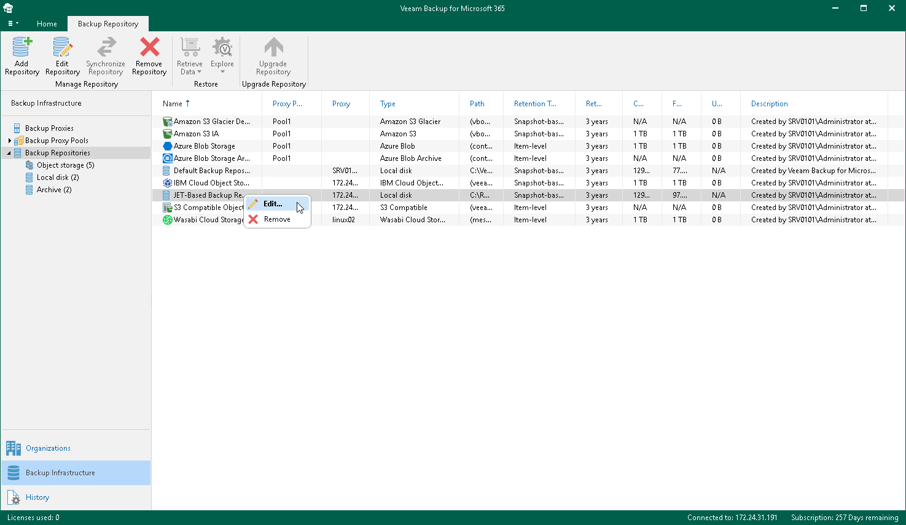

In this article

Veeam Backup for Microsoft 365 allows you to edit settings of your backup repository.

Editing JET-Based Repository Settings

Before you edit settings of a JET-based backup repository, consider the following limitations:

* Changing the target location for backups is not possible.
* Editing the Backup proxy and Path values is not possible.
* The retention type cannot be changed once set. For more information, see [Retention Policy](retention_policy.md).
* The Edit command is unavailable if a JET-based backup repository is out of date. For information on how to upgrade backup repositories, see [Upgrading Backup Repositories](vbo_upgrading_repository.md).

To edit settings of a JET-based backup repository, do the following:

1. Open the Backup Infrastructure view.
2. In the inventory pane, select one of the following nodes:

* Backup Repositories. Contains all backup repositories added to the Veeam Backup for Microsoft 365 backup infrastructure.
* Local disk. Contains Default Backup Repository and other JET-based backup repositories.

1. In the preview pane, do one of the following:

* Select a JET-based backup repository and click Edit Repository on the ribbon.

* Right-click a JET-based backup repository and select Edit.

1. Modify the required settings.

You can change the following parameters:

* The backup repository name and description.
* The retention period.
* How often you want to apply a retention policy.

Editing Object Storage Repository Settings

Before you edit settings of an object storage repository, consider the following limitations:

* Changing the target location for backups is not possible.
* Changing the object storage type, Amazon storage type and storage class and Azure Blob Storage access tier is not possible.
* The user account credentials to access object storage and settings to connect Amazon S3 bucket, S3 Compatible bucket and Azure Blob Storage container cannot be changed once set.
* Editing the Backup proxy or proxy pool value is not possible. You can associate the object storage repository with another backup proxy server or backup proxy pool through REST API and PowerShell. To do this, run the [Start-VBORepositoryOwnerChangeSession](https://helpcenter.veeam.com/docs/vbo365/powershell/start-vborepositoryownerchangesession.html?ver=80) cmdlet or use the POST /BackupRepositories/{repositoryId}/changeOwner method.
* The retention type cannot be changed once set. For more information, see [Retention Policy](retention_policy.md).
* You cannot enable or disable data immutability. For more information, see [Immutability](immutability.md).
* You cannot enable or disable usage of the governance mode. For more information, see [Immutability](immutability.md).
* You cannot enable or disable encryption. For more information, see [Data Encryption](data_encryption.md).

To edit object storage repository settings, do the following:

1. Open the Backup Infrastructure view.
2. In the inventory pane, select one of the following nodes:

* Backup Repositories. Contains all backup repositories added to the Veeam Backup for Microsoft 365 backup infrastructure.
* Object storage. Contains S3 Compatible object storage repositories, Azure Blob Storage Hot/Cool access tiers, Amazon S3 Standard, Amazon S3 Standard-Infrequent Access and Amazon S3 One Zone-Infrequent Access storage classes.
* Archive. Contains Azure Blob Storage Archive access tier and all Amazon S3 Glacier storage classes.

1. In the preview pane, do one of the following:

* Select an object storage repository and click Edit Repository on the ribbon.

* Right-click an object storage repository and select Edit.

1. Modify the required settings.

You can change the following parameters:

* The object storage repository name and description.
* The object storage repository capacity to prohibit running new jobs when the specified value is exceeded.
* For Microsoft Azure Blob Storage and Amazon S3 object storage repositories, you can enable of disable usage of the archiver appliance, and change the archiver appliance settings.
* The retention period.

|  |
| --- |
| Note |
| Changing the retention period for the object storage repository with the enabled data immutability is only possible for the object storage repository where you store backups. |

* How often you want to apply the retention policy.
* The immutability period.

|  |
| --- |
| Note |
| Consider the following:   * Changing the immutability period is not applicable for the object storage repository where you store backup copies. * Changing the immutability period is only possible if this value is set in days. * You can make the immutability period not longer than the specified retention period. * You cannot make the immutability period shorter. |

* The encryption password if encryption of backups in object storage has been enabled.

Related Topics

* [Adding JET-Based Backup Repositories](vbo_adding_repository.md)
* [Adding Object Storage Repositories](adding_object_storage.md)

Page updated 7/7/2025

Page content applies to build 8.3.0.2201
