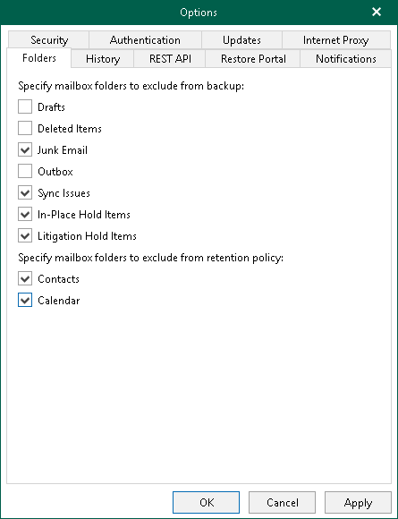

In this article

You can configure folder exclusions if you do not want certain folders to be backed up by a [backup job](vbo_data_backup.md) or removed by a [retention policy](retention_policy.md).

To configure exclusions, do the following:

1. In the main menu, click General Options.
2. Open the Folders tab.
3. In the Specify mailbox folders to exclude from backup section, select check boxes next to folders that you want to exclude from a backup.
4. Click OK.

|  |
| --- |
| Note |
| Consider the following:   * When you select the Deleted Items check box, both deleted and permanently deleted items will be excluded. * When you do not select the In-Place Hold Items or Litigation Hold Items check boxes, Veeam Backup for Microsoft 365 will create backup folders with similar names. If the Litigation Hold and In-Place Hold properties are enabled for a mailbox, Veeam Backup for Microsoft 365 will back up items marked for purging from the mailbox database into these backup folders. For more information, see [this Microsoft article](https://learn.microsoft.com/en-gb/exchange/policy-and-compliance/holds/holds?view=exchserver-2019) and [this Microsoft article](https://learn.microsoft.com/en-us/exchange/security-and-compliance/recoverable-items-folder/recoverable-items-folder). |

To prevent mailbox folders to be removed by a retention policy, do the following:

1. In the main menu, click General Options.
2. Open the Folders tab.
3. In the Specify mailbox folders to exclude from retention policy section, select folders that you want to preserve during a retention session.

1. Click OK.

Page updated 4/22/2025

Page content applies to build 8.3.0.2201
