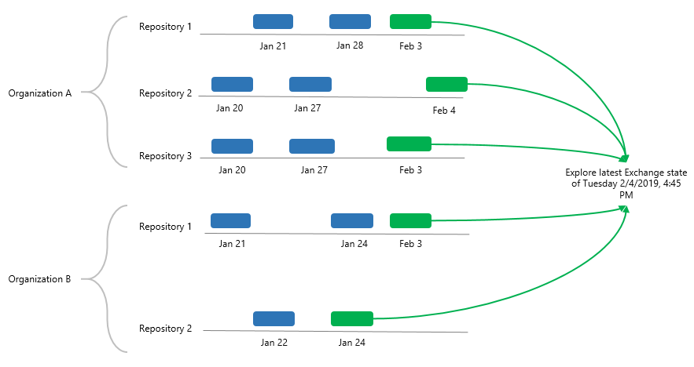
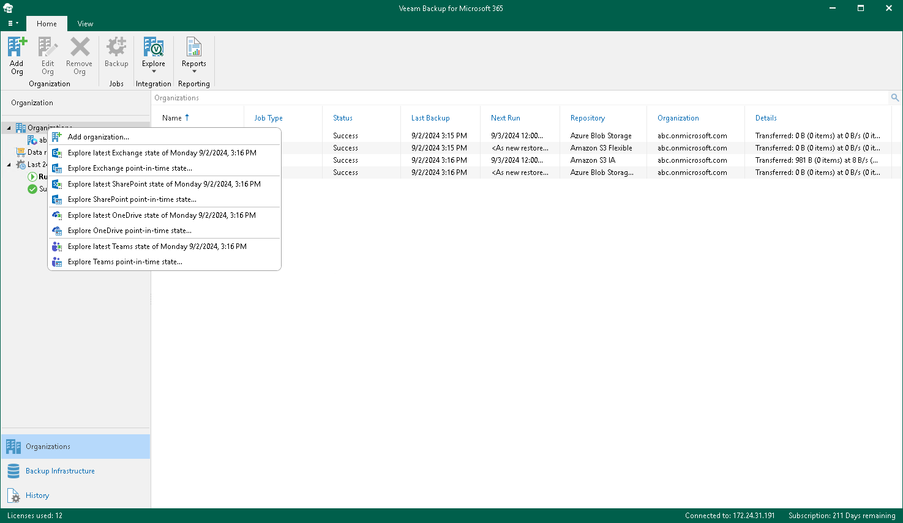

In this article

When exploring all organizations, Veeam Backup for Microsoft 365 merges and loads the latest restore points of each backup job of every organization.

|  |
| --- |
| Note |
| If you remove specific objects from a backup job scope or remove a backup job from the Veeam Backup for Microsoft 365 configuration, all backup data created by this job remains in a backup repository and will be loaded into the Veeam Explorers scope. |

The following is an example of exploring two organizations: A and B. The organization A has three backup jobs and the organization B has two backup jobs.

When exploring the organization A, the following restore points will be merged and loaded into the Veeam Explorers scope:

* For Repository 1, only the restore point created on February 3.
* For Repository 2, only the restore point created on February 4.
* For Repository 3, only the restore point created on February 3.

When exploring the organization B, the following restore points will be merged and loaded into the Veeam Explorers scope:

* For Repository 2, only the restore point created on February 3.
* For Repository 2, only the restore point created on January 24.

To open backups of all organizations, do the following:

1. Open the Organizations view.
2. Right-click the root Organizations node and select one of the following options:

* Explore latest <product> state of <date\_and\_time>. To explore the latest backup state.
* Explore <product> point-in-time state. To select a point-in-time state. For more information, see [Exploring Point In Time](vbo_exploring_point_in_time.md).

where <product> is one of the following services: Exchange, SharePoint, OneDrive, or Teams.

Page updated 9/2/2024

Page content applies to build 8.3.0.2201
