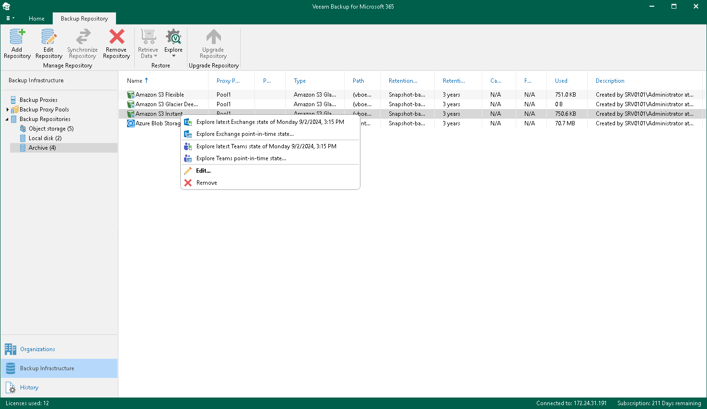
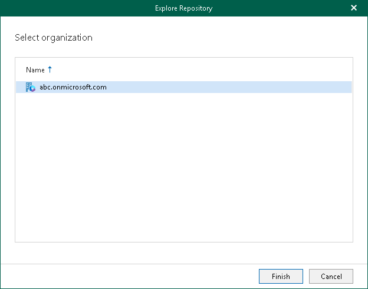

# Exploring Backup Copies

You can start exploring and restoring data from backup copies stored in the following object storage repositories:

* Azure Blob Storage Hot/Cool/Cold access tier
* Amazon S3 Standard storage class
* Amazon S3 Standard-Infrequent Access storage class
* Amazon S3 One Zone-Infrequent Access storage class
* Amazon S3 Glacier Instant Retrieval storage class
* S3 Compatible object storage repository

To open backup copies stored in the selected object storage repository, do the following:

1. Open the Backup Infrastructure view.
2. In the inventory pane, select one of the following nodes:

* Backup Repositories. Contains all backup repositories added to the Veeam Backup for Microsoft 365 backup infrastructure.
* Backup Repositories > Object Storage. Contains Azure Blob Storage, Amazon S3 Standard, Amazon S3 Standard-Infrequent Access and Amazon S3 One Zone-Infrequent Access storage classes or S3 Compatible object storage repositories.
* Backup Repositories > Archive. Contains Amazon S3 Glacier Instant Retrieval storage class.

1. In the preview pane, select an object storage repository that contains backup copies that you want to open.
2. Do one of the following:

* On the Backup Repository tab, click Explore on the ribbon.

* Right-click a backup repository.

1. Select one of the following options:

* Explore latest <product> state of <date\_and\_time>. To explore the latest backup state.
* Explore <product> point-in-time state. To select a point-in-time state. For more information, see [Exploring Point In Time](vbo_exploring_point_in_time.md).

where <product> is one of the following services: Exchange, SharePoint, OneDrive, or Teams.

1. If you selected the Explore latest <product> state of <date\_and\_time> option, in the Explore Repository wizard window, select an organization.

Veeam Backup for Microsoft 365 will open backed-up data from backup copies created for the selected organization.

