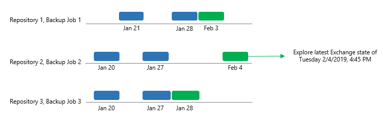
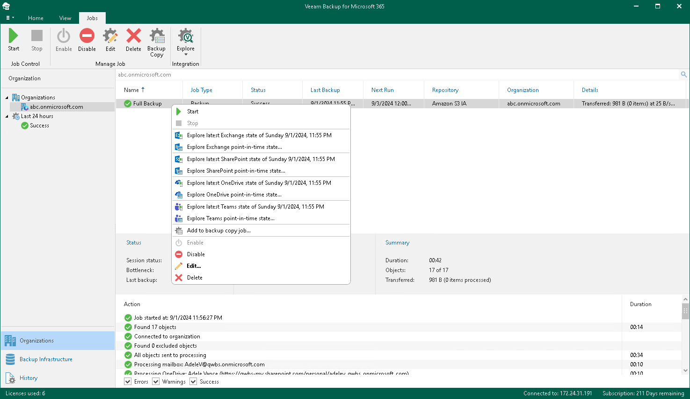

# Exploring Backup Jobs

When exploring backup jobs, Veeam Backup for Microsoft 365 loads the latest restore point that was created by the selected job.

The following is an example of exploring the Backup Job 2 from the Repository 2. This job has three restore points created on January 20, January 27 and February 4. In such a scenario, Veeam Backup for Microsoft 365 loads only the latest restore point (created on February 4) into the Veeam Explorers scope.

To open backups created by the selected backup job, do the following:

1. Open the Organizations view.
2. In the inventory pane, select an organization.
3. In the preview pane, select a backup job that contains backups that you want to open.
4. On the Jobs tab, click Explore, or right-click a backup job and select one of the following options:

* Explore latest <product> state of <date\_and\_time>. To explore the latest backup state.
* Explore <product> point-in-time state. To select a point-in-time state. For more information, see [Exploring Point In Time](vbo_exploring_point_in_time.md).

where <product> is one of the following services: Exchange, SharePoint, OneDrive, or Teams.

