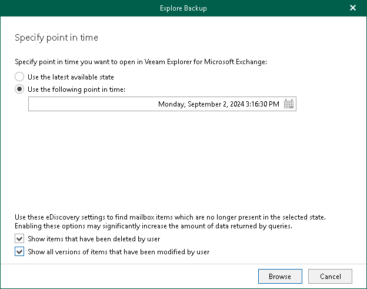

In this article

When exploring a point-in-time state, Veeam Backup for Microsoft 365 runs the Explore Backup wizard.

At the Specify point in time step of the wizard, select a backup state that you want to open:

1. Select one of the following options:

* Use the latest available state. Select this option to load the latest state of items in the backup file.
* Use the following point in time. Select this option to load a backup as of the selected date.

1. If you want to view historic data, select the following check boxes:

* Show items that have been deleted by user. Select this option to show items that have been removed by the user before the specified date.
* Show all versions of items that have been modified by user. Select this option to show all versions of items that have been modified by the user before the specified date.

Page updated 9/2/2024

Page content applies to build 8.3.0.2201
