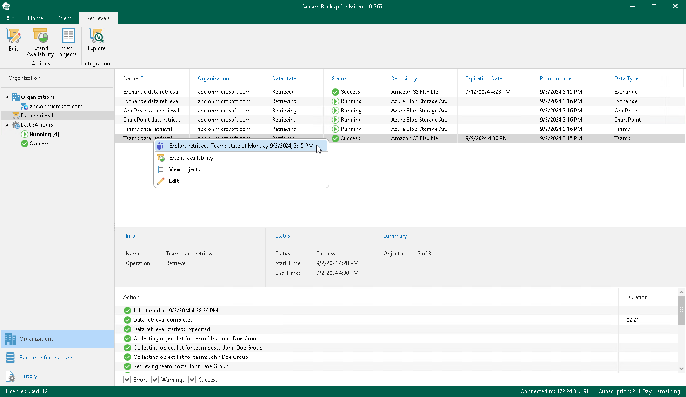

In this article

You can explore backed-up data you have retrieved from the following object storage repositories: Azure Blob Storage Archive access tier, Amazon S3 Glacier Flexible Retrieval or Amazon S3 Glacier Deep Archive storage classes. For more information on how to retrieve backed-up data, see [Retrieving Backed-Up Data](retrieving_backed_up_files.md).

|  |
| --- |
| Note |
| By default, the retrieved data is available for explore during 1 day. You can specify the availability period at the [Specify Availability Period](availability_period.md) step of the Retrieve Backup Copy wizard.  If the retrieved data is restored by Veeam Explorers, the availability period is prolonged automatically for the remaining duration of the restore process. You can extend the availability period. For more information, see [Editing Retrieval Job Settings](editing_retrieval_job_settings.md) and [Extending Availability of Retrieved Data](vbo_extending_availability.md). |

To open backups that you have retrieved, do the following:

1. Open the Organizations view.
2. In the inventory pane, select the Data retrieval node.
3. In the preview pane, do one of the following:

* Select a retrieval job that contains backed-up data that you want to open and click Explore on the ribbon.

* Right-click a retrieval job and select Explore retrieved <product> state.

where <product> is one of the following services: Exchange, SharePoint, OneDrive, or Teams.

Page updated 9/2/2024

Page content applies to build 8.3.0.2201
