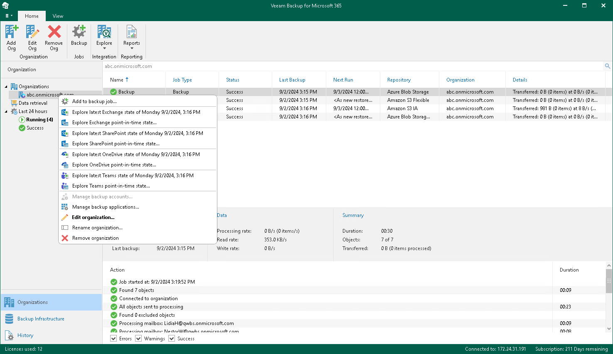

# Exploring Single Organization

When exploring a single organization, Veeam Backup for Microsoft 365 merges and loads the latest restore points that have been created by each backup job of the selected organization.

|  |
| --- |
| Note |
| If you remove specific objects from a backup job scope or remove a backup job from the Veeam Backup for Microsoft 365 configuration, all backup data created by this job remains in a backup repository and will be loaded into the Veeam Explorers scope. |

The following is an example of exploring a single organization with backups that are stored in three different [backup repositories](vbo_backup_repositories.md). In such a scenario, the following restore points will be merged and loaded into the Veeam Explorers scope:

* For Repository 1, only the restore point created on February 3.
* For Repository 2, only the restore point created on February 4.
* For Repository 3, only the restore point created on February 3.

To open backups created by all backup jobs of a specific organization, do the following:

1. Open the Organizations view.
2. In the inventory pane, right-click an organization and select one of the following options:

* Explore latest <product> state of <date\_and\_time>. To explore the latest backup state.
* Explore <product> point-in-time state. To select a point-in-time state. For more information, see [Exploring Point In Time](vbo_exploring_point_in_time.md).

where <product> is one of the following services: Exchange, SharePoint, OneDrive, or Teams.

