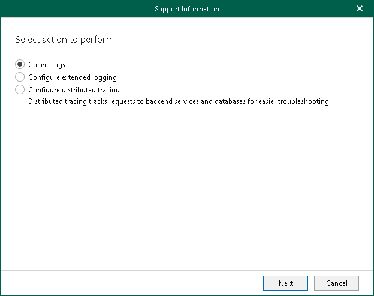
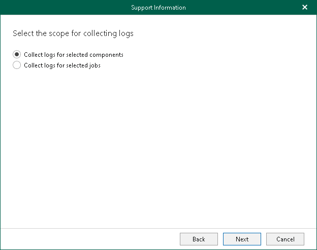
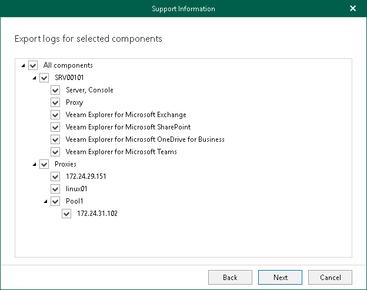
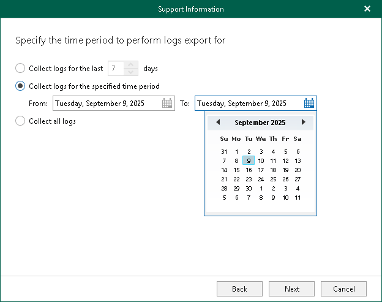
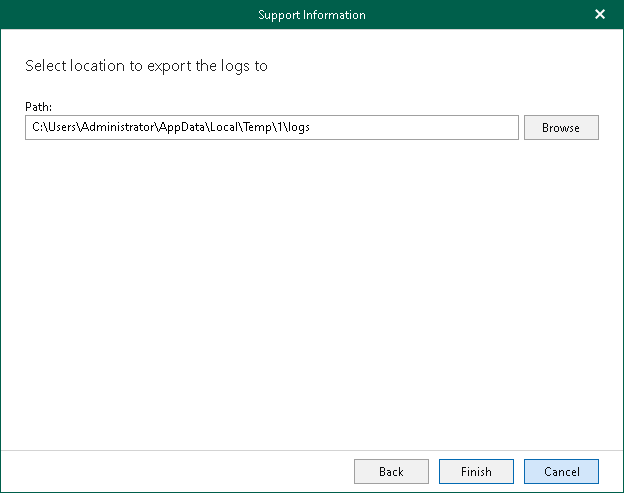
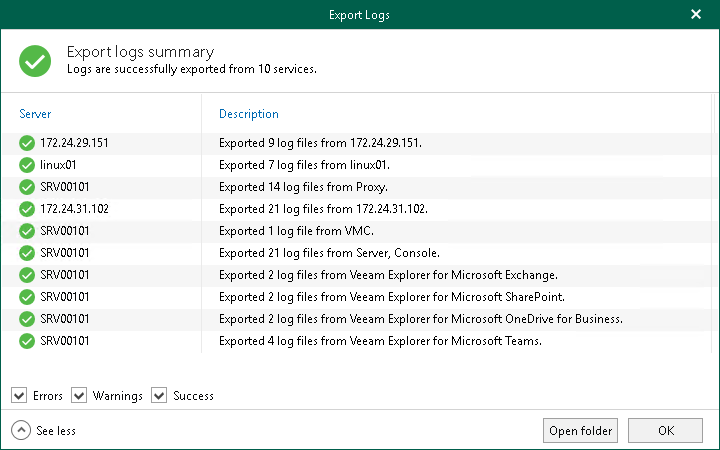

In this article

To collect log files for the Veeam Backup for Microsoft 365 backup infrastructure components, do the following:

1. In the main menu, click Help and Support > Support information.
2. Select the Collect logs option.

1. Select the Collect logs for selected components option.

1. Select the Veeam Backup for Microsoft 365 infrastructure components for which to obtain log files. If Veeam Explorers are installed on the machine that runs Veeam Backup for Microsoft 365, you can select them as well. Additionally, Veeam Backup for Microsoft 365 collects information about general settings of the product and the backup infrastructure components, as well as Veeam Backup for Microsoft 365 license details.

1. Specify a time period for log export:

* Select the Collect logs for the last N days option to specify the number of days for which to export your log files.
* Select the Collect logs for the specified time period option to set up a period for log files export.
* Select the Collect all logs option to export all existing log files regardless of the time period.

1. Specify the path.

1. Click Finish.

Once log files are collected, Veeam Backup for Microsoft 365 prompts you to view logs collection statistics by expanding the Export Logs dialog. You can open a folder where log files were exported. To do this, click Open folder.

Page updated 9/9/2025

Page content applies to build 8.3.0.2201
