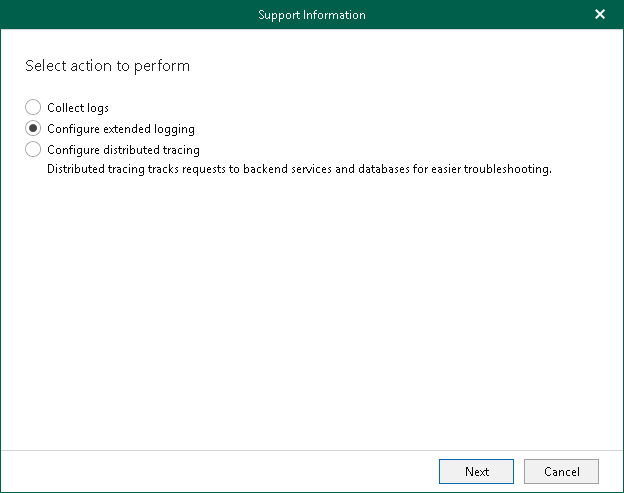
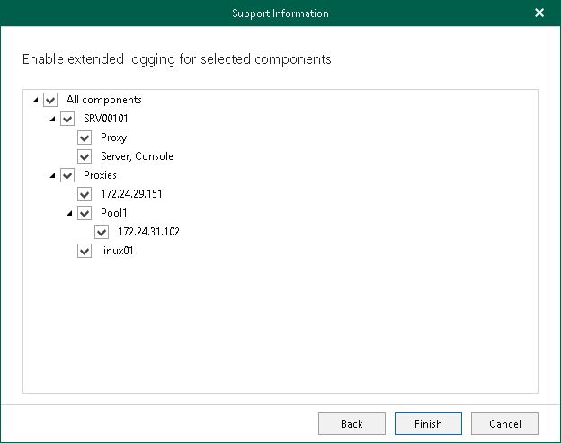

# Enabling Extended Logging Mode

Extended logging mode augments log records generated during the Veeam Backup for Microsoft 365 operation. In comparison to log records generated by default, extended log records contain additional information such as more detailed description of operations performed during the backup and restore processes, as well as more detailed description of items processed during backup and restore.

Veeam Customer Support specialists use log files generated in the extended logging mode to troubleshoot product operation issues and may ask you to enable this mode after you report a problem to Veeam Customer Support.

To enable extended logging mode, do the following:

1. In the main menu, click Help and Support > Support information.
2. Select the Configure extended logging option.

1. Select components (local or remote) to which you want to apply the extended logging mode.

1. Click Finish.

After you enable extended logging mode, you need to go back to the main application window and perform actions for which you want to collect additional information. Then you can collect logs. For more information, see [Collecting Log Files for Veeam Backup for Microsoft 365 Components](vbo_exporting_logs.md) and [Collecting Log Files for Backup and Backup Copy Jobs](vbo_exporting_logs_jobs.md).

