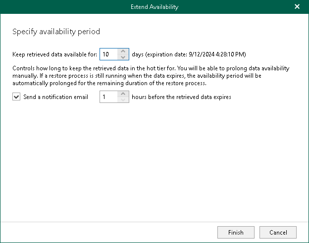

In this article

You can extend the availability period of the retrieved backed-up data.

To extend the availability period of the retrieved backed-up data, do the following:

1. Open the Organizations view.
2. In the inventory pane, select the Data retrieval node.
3. In the preview pane, do one of the following:

* Select a retrieval job with backed-up data which availability period you want to extend and click Extend Availability on the ribbon.

* Right-click a retrieval job and select Extend Availability.

1. In the wizard window that opens, specify number of days during which the retrieved backed-up data will be available to explore and restore using Veeam Explorers.
2. If you want to receive a notification that the availability period is about to end, select the Send a notification email N hours before the retrieved data expires check box and specify the time for the notification.

Page updated 9/2/2024

Page content applies to build 8.3.0.2201
