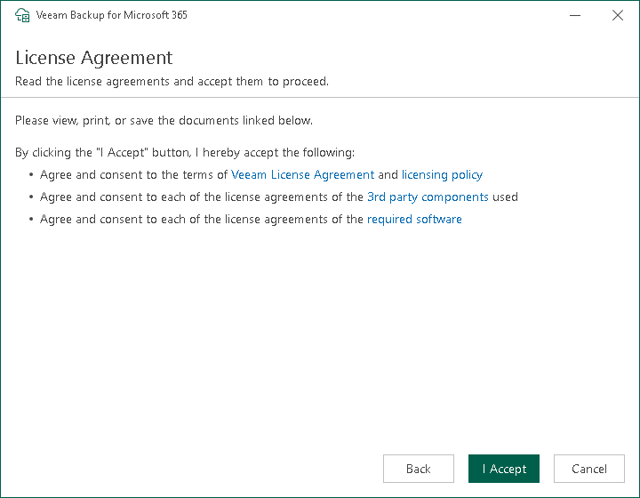

In this article

At the License Agreement step, click the links to read Veeam License Agreement and licensing policy as well as license agreements of the 3rd party components that Veeam incorporates and license agreements of the required software. To accept the license agreements and continue installing Veeam Backup for Microsoft 365, click I Accept.

Page updated 7/11/2024

Page content applies to build 8.3.0.2201
