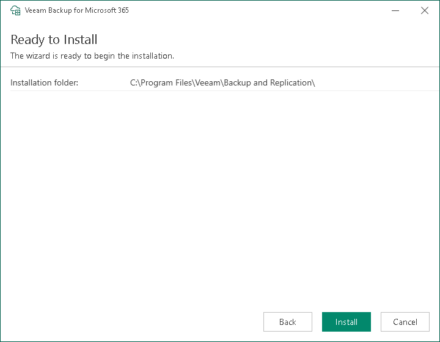

# Step 5. Begin Installation

At the Ready to install step, review the Veeam Explorers installation folder and click Install.

Veeam Explorers are installed to the C:\Program Files\Veeam\Backup and Replication\Explorers folder. Keep in mind that you cannot specify a different location for Veeam Explorers.

Wait for the installation process to complete and click Finish to exit the wizard.

