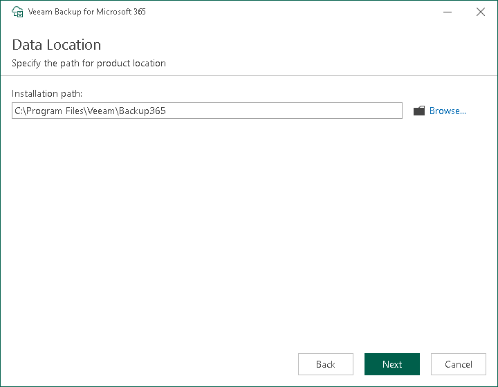

In this article

This step is only available if you have selected to configure installation settings manually at the [Review Default Installation Settings](vbo_install_default_settings_ps.md) step of the wizard.

At the Data Location step, specify the Veeam Backup for Microsoft 365 PowerShell toolkit installation folder.

By default, the Veeam Backup for Microsoft 365 PowerShell toolkit is installed to the C:\Program Files\Veeam\Backup365 folder. To install to a different location, click Browse and specify a folder.

Page updated 9/16/2025

Page content applies to build 8.3.0.2201
