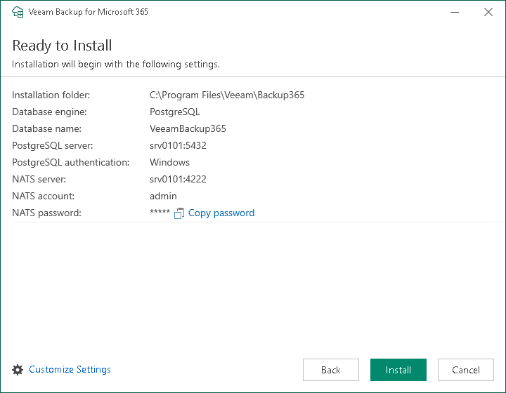

# Step 6. Review Default Installation Settings

At the Ready to Install step, you can select to install Veeam Backup for Microsoft 365 with default installation settings or specify custom installation settings.

Do one of the following:

* To use the default installation settings and start the installation process, click Install.
* To use custom installation settings, click Customize Settings. The installation wizard will include additional steps that will let you configure installation settings.

The following table lists the default installation settings:

| Setting | Default value | Description |
| --- | --- | --- |
| Installation folder | C:\Program Files\Veeam\Backup365 | Folder where Veeam Backup for Microsoft 365 will be installed. |
| Database engine | PostgreSQL | The installation wizard deploys PostgreSQL 15.14 as a database engine locally on the Veeam Backup for Microsoft 365 server. |
| Database name | VeeamBackup365 | The installation wizard deploys the Veeam Backup for Microsoft 365 configuration database on the locally installed PostgreSQL instance. |
| PostgreSQL server | <host\_name>:5432 | The local host name and port number to be used by SQL server. |
| PostgreSQL authenticaton | Windows | Authentication mode to connect to the installed PostgreSQL instance. |
| NATS server | <host\_name>:4222 | The local host name and port number to be used by the NATS server. |
| NATS account | admin | Account name to connect to the NATS server. |
| NATS password | <automatically generated value> | Password to connect to the NATS server. |

|  |
| --- |
| Important |
| Veeam Backup for Microsoft 365 automatically generates a password to connect to the NATS server. If you want to install Veeam Backup for Microsoft 365 with default installation settings, click Copy password to copy the password and then save it locally for further use. |

