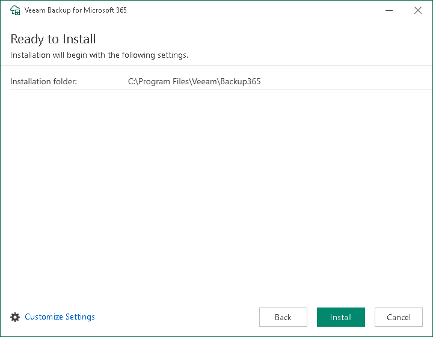

# Step 5. Review Default Installation Settings

At the Ready to Install step, you can select to install the Veeam Backup for Microsoft 365 console with default installation settings or specify custom installation settings.

Do one of the following:

* To use the default installation settings and start the installation process, click Install.
* To use custom installation settings, click Customize Settings. The installation wizard will include additional steps that will let you configure installation settings.

The following table lists the default installation settings:

| Setting | Default value | Description |
| --- | --- | --- |
| Installation folder | C:\Program Files\Veeam\Backup365 | Folder where the Veeam Backup for Microsoft 365 console will be installed. |

