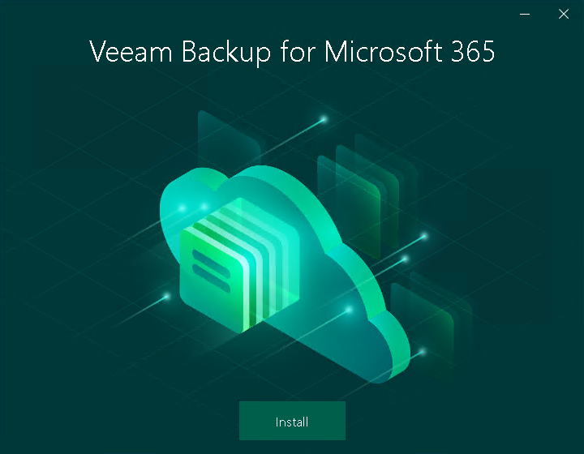

In this article

To launch the installation wizard, do the following:

1. Download the Veeam Backup for Microsoft 365 installation package. For more information, see [Downloading Installation Package](download_package.md).
2. Open the Veeam.Backup365.iso file and run the Veeam.Setup.exe file.
3. On the splash screen, click Install.

Page updated 7/11/2024

Page content applies to build 8.3.0.2201
