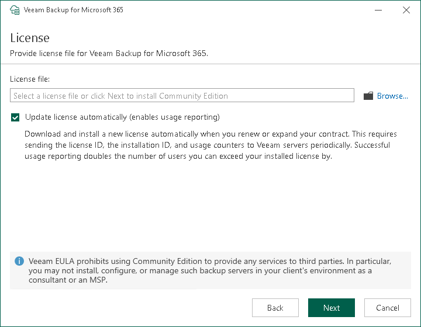

In this article

At the License step, you can specify a license that you want to install to Veeam Backup for Microsoft 365. For more information, see [Licensing and License Types](vbo_licensing.md).

If a valid license is already installed on the machine, you can skip this step and proceed to the [next step](vbo_install_configuration_check.md) of the wizard.

If you do not specify a license, the product will operate in the Community Edition mode. You can install a license at any time later. For more information, see [Installing and Updating License](vbo_installing_license.md).

To provide a license:

1. Next to the License file field, click Browse.
2. In the displayed window, specify the path to the .lic file.
3. Select the Update license automatically check box to install new licenses automatically when you renew or expand your contract. If you enable the automatic license update, and therefore enable usage reporting, you will double the number of workloads by which you can exceed your installed license. For more information, see the License Exceeded sections for [Subscription License](vbo_subscription_license.md#Exceeded) and [Rental License](vbo_rental_license.md#Exceeded).

Page updated 9/3/2024

Page content applies to build 8.3.0.2201
