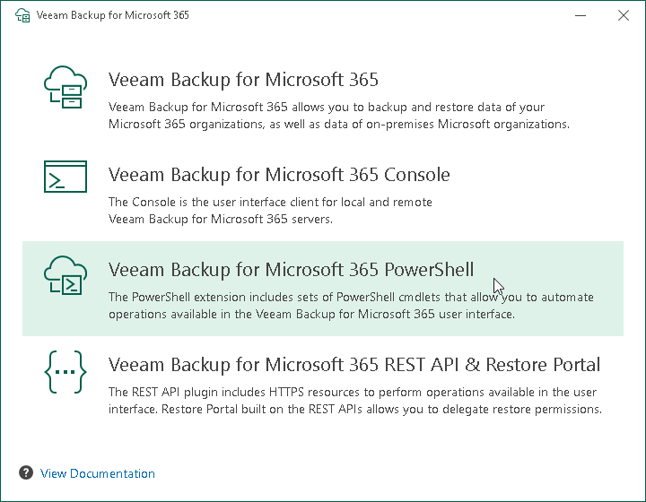

In this article

At this step of the wizard, click Veeam Backup for Microsoft 365 PowerShell.

To open Veeam Help Center from the installation wizard, click View Documentation.

Page updated 9/16/2025

Page content applies to build 8.3.0.2201
