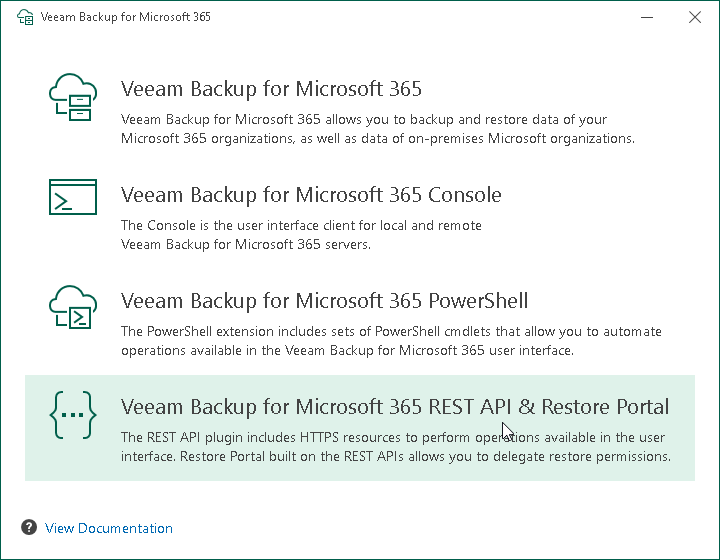

# Step 2. Select Component

At this step of the wizard, click Veeam Backup for Microsoft 365 REST API & Restore Portal.

To open Veeam Help Center from the installation wizard, click View Documentation.

